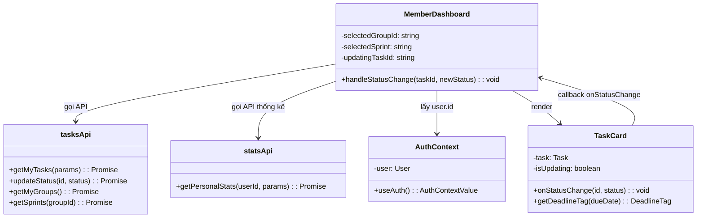
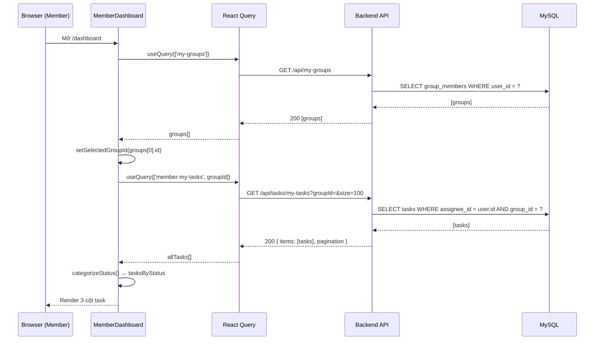
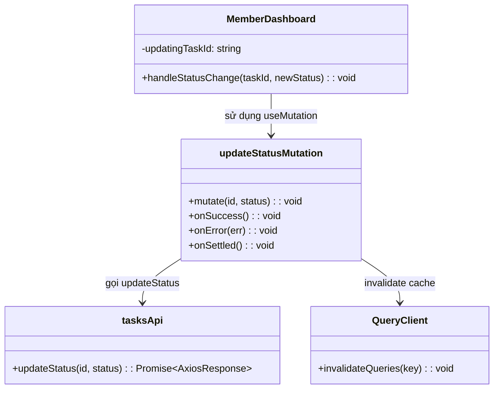
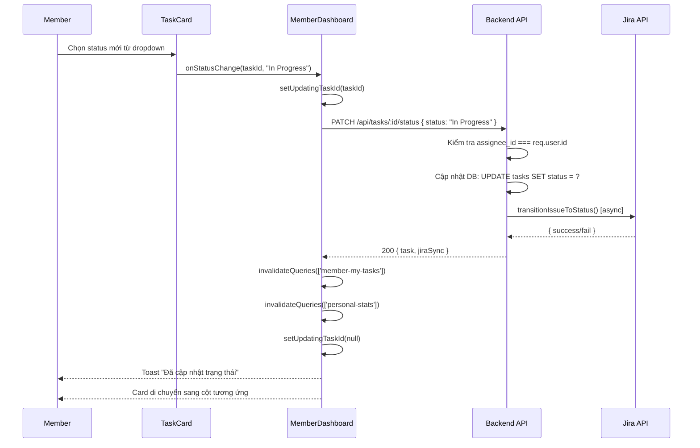
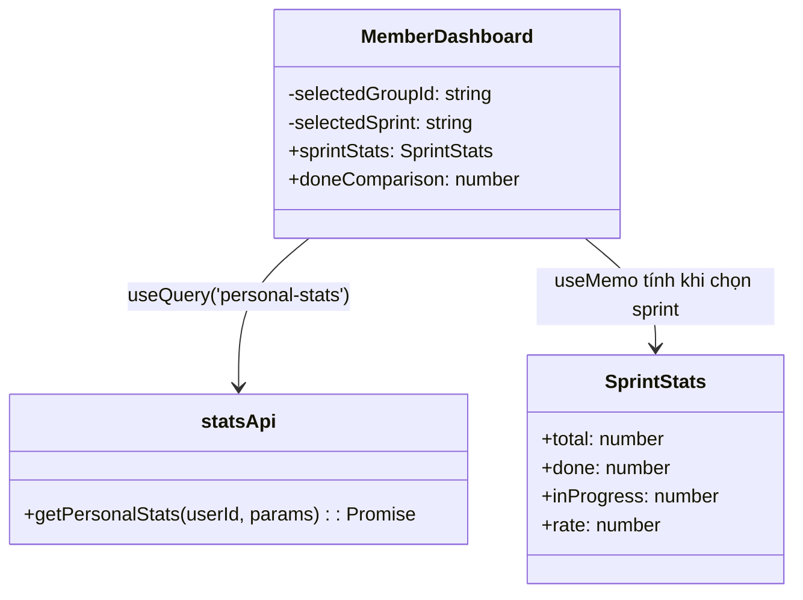
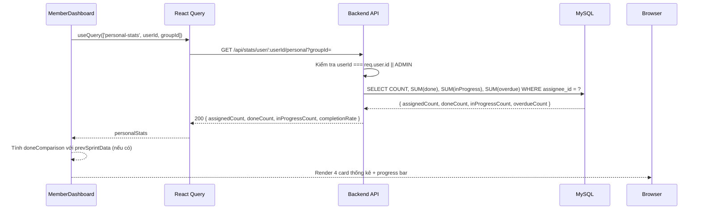
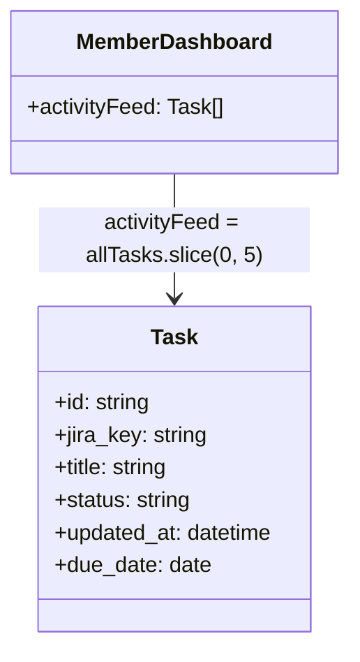
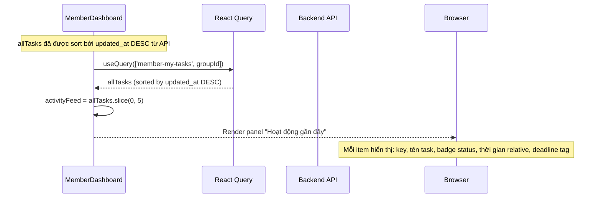

# CHS-18 — Team Member UI
> **Dự án:** SWP391 – Jira Sync & Task Management  
> **Phiên bản:** 1.0  
> **Ngày:** 25/03/2026  
> **Người thực hiện:** Team Member  

---

## Định nghĩa và Từ viết tắt

| Từ viết tắt | Định nghĩa |
|---|---|
| SRS | Software Requirement Specification – Đặc tả yêu cầu phần mềm |
| SDD | Software Design Description – Mô tả thiết kế phần mềm |
| UC | Use Case – Ca sử dụng |
| UI | User Interface – Giao diện người dùng |
| API | Application Programming Interface |
| JWT | JSON Web Token |
| FR | Functional Requirement – Yêu cầu chức năng |
| NFR | Non-Functional Requirement – Yêu cầu phi chức năng |

---

# III. Đặc tả Yêu cầu Phần mềm (SRS)

## 1. Tổng quan sản phẩm

### 1.1 Mô tả màn hình

Màn hình **Team Member UI** (CHS-18) được thiết kế dành riêng cho người dùng có vai trò `MEMBER`. Mục tiêu là cung cấp giao diện đơn giản, rõ ràng để member:

- Tập trung theo dõi **task được assign cho bản thân**.
- Đổi trạng thái task **trực tiếp** mà không cần reload trang.
- Nhận cảnh báo **deadline sắp tới** nổi bật.
- Xem **thống kê tiến độ cá nhân** trong sprint.
- Theo dõi **lịch sử cập nhật** task gần nhất.

---

## 2. Yêu cầu Người dùng

### 2.1 Actors

| # | Actor | Mô tả |
|---|---|---|
| 1 | Member | Thành viên nhóm đã được assign task. Có thể xem task của bản thân, cập nhật trạng thái, xem thống kê và lịch sử hoạt động cá nhân. |

### 2.2 Use Cases

#### 2.2.1 Sơ đồ Use Case

```
+-------------------------------------------------------+
|                   Team Member UI System               |
|                                                       |
|   +----------+                                        |
|   |          |--->[UC-01] Xem danh sách My Tasks      |
|   |          |--->[UC-02] Lọc task theo sprint        |
|   |          |--->[UC-03] Đổi status task             |
|   |  Member  |--->[UC-04] Xem badge deadline          |
|   |          |--->[UC-05] Xem thống kê cá nhân        |
|   |          |--->[UC-06] So sánh với sprint trước    |
|   |          |--->[UC-07] Xem activity feed           |
|   +----------+                                        |
+-------------------------------------------------------+
```

#### 2.2.2 Mô tả Use Case

| ID | Use Case | Actor | Mô tả Use Case |
|---|---|---|---|
| UC-01 | Xem danh sách My Tasks | Member | Member xem toàn bộ task được assign cho mình, phân nhóm theo ba cột trạng thái: To Do / In Progress / Done |
| UC-02 | Lọc task theo nhóm và sprint | Member | Member chọn nhóm (group) và sprint để lọc danh sách task hiển thị |
| UC-03 | Đổi trạng thái task | Member | Member thay đổi trạng thái task ngay trên card thông qua dropdown; hệ thống gọi API cập nhật và đồng bộ Jira |
| UC-04 | Xem badge deadline | Member | Hệ thống tự động highlight task có deadline ≤ hôm nay (màu đỏ) hoặc deadline ≤ 2 ngày (màu cam) |
| UC-05 | Xem thống kê cá nhân | Member | Member xem số task được giao, số task đã hoàn thành, số task đang thực hiện, và tỉ lệ % hoàn thành |
| UC-06 | So sánh tiến độ với sprint trước | Member | Khi chọn một sprint cụ thể, hệ thống hiển thị số task done so sánh với sprint trước đó (tăng/giảm) |
| UC-07 | Xem activity feed | Member | Member xem 5 task được cập nhật gần nhất của bản thân, bao gồm trạng thái hiện tại và thời gian cập nhật |

---

## 3. Yêu cầu Chức năng

### 3.1 Tổng quan chức năng hệ thống

#### 3.1.1 Luồng màn hình (Screen Flow)

```
[Đăng nhập] --> [MemberDashboard /dashboard]
                        |
              +---------+---------+
              |                   |
     [Chọn nhóm]          [Chọn sprint]
              |                   |
              +-----> [Cập nhật danh sách task]
                              |
              +---------------+---------------+
              |               |               |
        [Cột To Do]   [Cột In Progress]  [Cột Done]
              |               |               |
        [Dropdown đổi status trực tiếp trên card]
              |
        [Gọi PATCH /api/tasks/:id/status]
              |
        [Cập nhật UI không reload]
```

#### 3.1.2 Mô tả màn hình

| # | Tính năng | Màn hình | Mô tả |
|---|---|---|---|
| 1 | My Tasks | MemberDashboard | Hiển thị toàn bộ task được assign, phân thành 3 cột theo trạng thái. Có bộ lọc theo nhóm và sprint ở góc trên bên phải. |
| 2 | Status Update | Card trong cột | Mỗi card task có dropdown cho phép đổi status ngay lập tức: To Do → In Progress → Done |
| 3 | Deadline Badge | Card task | Task có `due_date` ≤ hôm nay highlight viền đỏ + tag "Hôm nay!" / "Quá hạn X ngày". Task `due_date` trong 2 ngày tới highlight viền cam + tag "Còn X ngày". |
| 4 | Thống kê cá nhân | Hàng 4 card stat | Hiển thị: Tổng task được giao, Đã hoàn thành, Đang thực hiện, % Hoàn thành (thanh progress) |
| 5 | So sánh sprint | Card "Đã hoàn thành" | Khi chọn sprint cụ thể, hiển thị ↑/↓ so với sprint liền trước |
| 6 | Activity Feed | Cột phải | Danh sách 5 task được cập nhật gần nhất: key, tên, trạng thái, thời gian relative, deadline tag nếu có |
| 7 | Cảnh báo quá hạn | Alert đầu trang | Khi có task overdue, hiển thị alert màu đỏ với số lượng task quá hạn |

#### 3.1.3 Phân quyền màn hình

| Màn hình | Admin | Leader | Lecturer | Member |
|---|---|---|---|---|
| MemberDashboard (`/dashboard`) | ✗ | ✗ | ✗ | ✓ |
| Dropdown đổi status | ✗ | ✗ | ✗ | ✓ (chỉ task của mình) |
| Xem badge deadline | ✗ | ✗ | ✗ | ✓ |
| Thống kê cá nhân | ✓ (xem user khác) | ✗ | ✗ | ✓ (chỉ của mình) |
| Activity feed | ✗ | ✗ | ✗ | ✓ |

---

### 3.2 My Tasks — Xem danh sách task

**Function Trigger:**  
Member đăng nhập → hệ thống chuyển hướng tới `/dashboard` → màn hình tự động load danh sách task.

**Function Description:**
- **Actors:** Member
- **Purpose:** Cho phép member xem toàn bộ task được assign cho bản thân, phân nhóm trực quan theo trạng thái.
- **Interface:** Ba cột dọc song song: To Do / In Progress / Done. Mỗi cột có badge số đếm. Có bộ lọc nhóm (Select) và sprint (Select có AllClear) ở header trang.
- **Data Processing:** Gọi `GET /api/tasks/my-tasks?groupId=&size=100`, dữ liệu trả về được phân loại client-side vào 3 bucket theo hàm `categorizeStatus()`.

**Function Details:**

- **Validation:**
  - Member phải đã xác thực (JWT hợp lệ).
  - Nếu member không thuộc nhóm nào, hiển thị trang `<Empty>` với thông báo hướng dẫn.

- **Business Rules:**
  - Member chỉ thấy task có `assignee_id = user.id` — được đảm bảo bởi backend endpoint `GET /api/tasks/my-tasks`.
  - Trạng thái được chuẩn hóa theo bảng sau:

| Nhóm | Giá trị status từ Jira |
|---|---|
| To Do | `to do`, `todo`, `open`, `backlog`, `selected for development` |
| In Progress | `in progress`, `in-progress`, `doing`, `review`, `code review`, `testing`, `qa` |
| Done | `done`, `closed`, `resolved`, `complete`, `completed` |
| Other | Tất cả giá trị còn lại |

- **Normal Case:**  
  Member mở trang → hệ thống fetch API → render 3 cột với task tương ứng → hiển thị số đếm trên badge mỗi cột.

- **Abnormal Case:**  
  Không có task nào → mỗi cột hiển thị component `<Empty>` với thông báo "Không có task".  
  API lỗi hoặc mất kết nối → hiển thị Spin đang tải, query được cache bởi React Query.

---

### 3.3 Status Update — Đổi trạng thái task

**Function Trigger:**  
Member click vào dropdown trên card task → chọn trạng thái mới.

**Function Description:**
- **Actors:** Member
- **Purpose:** Cho phép member cập nhật trạng thái task ngay trên giao diện, không cần mở trang khác.
- **Interface:** Dropdown `<Select>` nhỏ ở cuối mỗi card, hiển thị 3 lựa chọn: `To Do`, `In Progress`, `Done` với màu sắc tương ứng.
- **Data Processing:** Gọi `PATCH /api/tasks/:id/status` với body `{ status }`. Sau khi thành công, invalidate cache React Query để cập nhật danh sách và thống kê.

**Function Details:**

- **Validation:**
  - Chỉ member được assign task mới có thể thay đổi status (backend kiểm tra `assignee_id === req.user.id`).
  - Trong khi đang gọi API, dropdown hiển thị trạng thái `loading`, không cho thao tác tiếp.

- **Business Rules:**
  - Sau khi đổi status, hệ thống tự động thử đồng bộ ngược lên Jira (backend xử lý, frontend không cần xử lý thêm).
  - Task sẽ tự động di chuyển sang cột tương ứng sau khi UI cập nhật.

- **Normal Case:**  
  Member chọn status mới → hiển thị spinner trên dropdown → API trả về 200 → toast "Đã cập nhật trạng thái" → card di chuyển sang cột mới.

- **Abnormal Case:**  
  API trả về lỗi (403, 500) → toast "Cập nhật thất bại" kèm thông báo lỗi từ server → dropdown trở về giá trị cũ.

---

### 3.4 Deadline Badge — Cảnh báo deadline

**Function Trigger:**  
Tự động khi task có trường `due_date` khác null được render lên màn hình.

**Function Description:**
- **Actors:** Member (chỉ xem, không thao tác)
- **Purpose:** Giúp member nhận ra ngay các task cần xử lý gấp mà không cần xem chi tiết từng task.
- **Interface:** Badge/Tag màu đỏ hoặc cam xuất hiện trên card task, đồng thời card có viền màu tương ứng.
- **Data Processing:** Tính số ngày còn lại = `dayjs(due_date).diff(dayjs(), 'day')`. Không gọi API thêm.

**Function Details:**

- **Validation:**  
  Chỉ hiển thị badge nếu `due_date` không null và task chưa ở trạng thái Done.

- **Business Rules:**

| Điều kiện | Màu | Nội dung badge | Màu viền card |
|---|---|---|---|
| `diff < 0` | Đỏ | "Quá hạn X ngày" | `#ff4d4f` |
| `diff === 0` | Đỏ | "Hôm nay!" | `#ff4d4f` |
| `0 < diff ≤ 2` | Cam | "Còn X ngày" | `#fa8c16` |
| `diff > 2` | — | Không hiện badge | Không có |

- **Normal Case:**  
  Task có deadline hôm nay → card nền đỏ nhạt, viền đỏ, tag "Hôm nay!".  
  Task còn 1 ngày → card nền vàng nhạt, viền cam, tag "Còn 1 ngày".

- **Abnormal Case:**  
  `due_date` là chuỗi không hợp lệ → `dayjs()` trả về `Invalid Date` → không hiển thị badge (fail-safe).

---

### 3.5 Thống kê cá nhân

**Function Trigger:**  
Tự động khi màn hình load hoặc khi member thay đổi nhóm/sprint.

**Function Description:**
- **Actors:** Member
- **Purpose:** Cung cấp cái nhìn tổng quan về tiến độ cá nhân trong nhóm/sprint đang xem.
- **Interface:** Hàng 4 card thống kê ở phía trên màn hình: Tổng task, Đã hoàn thành (có badge so sánh), Đang thực hiện, % Hoàn thành (thanh progress bar).
- **Data Processing:**
  - Khi **không chọn sprint**: gọi `GET /api/stats/user/:userId/personal?groupId=` → hiển thị thống kê toàn bộ.
  - Khi **chọn sprint cụ thể**: tính client-side từ danh sách task đã lọc theo sprint.

**Function Details:**

- **Validation:**
  - Chỉ member hoặc ADMIN mới gọi được endpoint `GET /api/stats/user/:userId/personal` (backend kiểm tra `req.user.id === userId || role === 'ADMIN'`).

- **Business Rules:**
  - Khi chọn sprint có sprint trước đó, hiển thị mũi tên `↑/↓` kèm số lượng task done chênh lệch so với sprint liền trước.
  - Progress bar chuyển sang màu xanh lá (success) khi đạt 100%.

- **Normal Case:**  
  Member mở trang với nhóm A, sprint "Sprint 2" → 4 card hiện đúng số liệu → badge so sánh "+2 so với sprint trước".

- **Abnormal Case:**  
  Member không có task nào → tất cả số liệu về 0, progress bar = 0%, không hiển thị badge so sánh.

---

### 3.6 Activity Feed — Lịch sử hoạt động

**Function Trigger:**  
Tự động khi màn hình load hoặc khi danh sách task được cập nhật.

**Function Description:**
- **Actors:** Member
- **Purpose:** Cho phép member xem nhanh 5 task được cập nhật gần nhất của bản thân mà không cần tìm kiếm.
- **Interface:** Cột nhỏ bên phải màn hình (panel), mỗi item hiển thị: key Jira, tên task (ellipsis), badge trạng thái, thời gian cập nhật (relative time), deadline tag nếu có.
- **Data Processing:** Lấy 5 phần tử đầu tiên của mảng `allTasks` (đã sort `updated_at DESC` từ API). Không gọi thêm API.

**Function Details:**

- **Validation:**  
  Chỉ hiển thị task thuộc member hiện tại (đã được lọc từ endpoint `my-tasks`).

- **Business Rules:**
  - Thời gian hiển thị dạng relative: "2 phút trước", "3 giờ trước" sử dụng `dayjs.fromNow()` locale tiếng Việt.
  - Mỗi item có tối đa 3 dòng hiển thị, không có scroll ngang.

- **Normal Case:**  
  Member cập nhật status task → activity feed tự refresh thông qua React Query invalidation → item mới nhất lên đầu danh sách.

- **Abnormal Case:**  
  Chưa có task nào → hiển thị `<Empty>` với thông báo "Chưa có hoạt động".

---

## 4. Yêu cầu Phi chức năng

| # | Yêu cầu | Mô tả |
|---|---|---|
| NFR-01 | Hiệu năng | Trang render trong < 2 giây với kết nối mạng bình thường. React Query cache giảm số lần gọi API khi điều hướng. |
| NFR-02 | Tính sẵn sàng | Khi API lỗi, UI không crash; hiển thị trạng thái loading hoặc thông báo lỗi rõ ràng. |
| NFR-03 | Bảo mật | JWT được kiểm tra ở cả frontend (ProtectedRoute) và backend (middleware auth.js). Member chỉ thấy task của mình. |
| NFR-04 | Tính nhất quán | Giao diện sử dụng Ant Design v6 nhất quán với toàn bộ hệ thống. |
| NFR-05 | Responsive | Giao diện hiển thị đúng trên màn hình desktop (≥1024px). Ở màn hình nhỏ hơn, 3 cột task chuyển thành layout dọc. |

---

# IV. Mô tả Thiết kế Phần mềm (SDD)

## 1. Thiết kế hệ thống

### 1.1 Kiến trúc hệ thống (liên quan CHS-18)

```
[Browser - Member]
       |
       v
[React Frontend - /dashboard]
       |
       | JWT Authorization Header
       v
[Express Backend - Node.js]
       |
   +---+---+
   |       |
   v       v
[MySQL] [Jira API]
```

- **Frontend:** React 19 + Vite + Ant Design v6 + TanStack React Query v5 + dayjs
- **Backend:** Node.js / Express — các endpoint được dùng: `GET /api/tasks/my-tasks`, `PATCH /api/tasks/:id/status`, `GET /api/stats/user/:userId/personal`, `GET /api/my-groups`, `GET /api/sprints/:groupId`
- **Xác thực:** JWT Bearer Token lưu tại `localStorage`, tự động refresh qua interceptor axios

### 1.2 Sơ đồ package Frontend (CHS-18)

| # | Package | Mô tả |
|---|---|---|
| 1 | `src/pages/member/` | Chứa `MemberDashboard.jsx` — trang chính của CHS-18 |
| 2 | `src/api/tasksApi.js` | Các hàm gọi API: `getMyTasks`, `updateStatus`, `getMyGroups`, `getSprints` |
| 3 | `src/api/tasksApi.js` (statsApi) | Hàm `getPersonalStats(userId, params)` — gọi `GET /api/stats/user/:userId/personal` |
| 4 | `src/auth/AuthContext.jsx` | Cung cấp `user.id`, `user.full_name` cho component |
| 5 | `src/api/axiosClient.js` | Axios instance với interceptor JWT + auto-refresh token |

---

## 2. Thiết kế Cơ sở dữ liệu (liên quan)

### 2.1 Bảng `tasks`

| Tên cột | Kiểu | Mô tả | Unique | Not null | PK/FK |
|---|---|---|---|---|---|
| id | CHAR(36) | UUID định danh task | Có | Có | PK |
| group_id | CHAR(36) | Nhóm sở hữu task | Không | Có | FK → groups |
| jira_key | STRING(50) | Mã Jira (VD: PROJ-1) | Có (per group) | Không | |
| title | TEXT | Tên/tiêu đề task | Không | Không | |
| status | STRING(100) | Trạng thái thô từ Jira | Không | Không | |
| priority | STRING(50) | Độ ưu tiên (High/Medium/Low) | Không | Không | |
| assignee_id | CHAR(36) | Người được giao task | Không | Không | FK → users |
| assignee_email | STRING(255) | Email người được giao (denormalized) | Không | Không | |
| sprint_name | STRING(255) | Tên sprint | Không | Không | |
| story_points | FLOAT | Story points | Không | Không | |
| due_date | DATEONLY | Deadline task | Không | Không | |
| created_at | DATETIME | Thời điểm tạo | Không | Có | |
| updated_at | DATETIME | Thời điểm cập nhật gần nhất | Không | Có | |

### 2.2 Bảng `users` (trích yếu)

| Tên cột | Kiểu | Mô tả | Unique | Not null | PK/FK |
|---|---|---|---|---|---|
| id | CHAR(36) | UUID định danh user | Có | Có | PK |
| email | STRING | Email đăng nhập | Có | Có | |
| full_name | STRING | Họ tên đầy đủ | Không | Không | |
| role | ENUM | `ADMIN`, `LECTURER`, `LEADER`, `MEMBER` | Không | Có | |

### 2.3 Bảng `group_members` (trích yếu)

| Tên cột | Kiểu | Mô tả | Unique | Not null | PK/FK |
|---|---|---|---|---|---|
| id | CHAR(36) | UUID | Có | Có | PK |
| group_id | CHAR(36) | Nhóm | Không | Có | FK → groups |
| user_id | CHAR(36) | Thành viên | Không | Có | FK → users |
| role_in_group | ENUM | `LEADER`, `MEMBER`, `VIEWER` | Không | Có | |

---

## 3. Thiết kế Chi tiết

### 3.1 Xem My Tasks

#### 3.1.1 Class Diagram



#### 3.1.2 Sequence Diagram



---

### 3.2 Đổi trạng thái task

#### 3.2.1 Class Diagram



#### 3.2.2 Sequence Diagram



---

### 3.3 Thống kê cá nhân

#### 3.3.1 Class Diagram



#### 3.3.2 Sequence Diagram



---

### 3.4 Activity Feed

#### 3.4.1 Class Diagram



#### 3.4.2 Sequence Diagram



---

# VI. Gói phát hành và Hướng dẫn Sử dụng

## 1. Gói phát hành

| # | Hạng mục | Mô tả |
|---|---|---|
| 1 | Source code Frontend | `frontend/src/pages/member/MemberDashboard.jsx` |
| 2 | API Client | `frontend/src/api/tasksApi.js` — bổ sung `statsApi.getPersonalStats` |
| 3 | Routing | `frontend/src/App.jsx` — route `/dashboard` của MEMBER |
| 4 | Layout | `frontend/src/layouts/AdminLayout.jsx` — menu MEMBER cập nhật |

## 2. Hướng dẫn Cài đặt

### 2.1 Yêu cầu hệ thống

| Thành phần | Tối thiểu | Khuyến nghị |
|---|---|---|
| Node.js | v18 | v20 LTS |
| npm | v9 | v10 |
| Trình duyệt | Chrome v110 | Chrome phiên bản mới nhất |
| Kết nối mạng | 10 Mbps | 50 Mbps |

### 2.2 Hướng dẫn chạy Frontend

**Bước 1:** Mở terminal và điều hướng đến thư mục frontend:
```
cd frontend
```

**Bước 2:** Cài đặt dependencies:
```
npm install
```

**Bước 3:** Khởi động server phát triển:
```
npm run dev
```

**Bước 4:** Mở trình duyệt, truy cập địa chỉ hiển thị trong terminal (thường là `http://localhost:5173`).

---

## 3. Hướng dẫn Sử dụng

### 3.1 Tổng quan

**Người dùng có vai trò `MEMBER` có thể:**
- Xem danh sách task được assign
- Lọc task theo nhóm và sprint
- Đổi trạng thái task
- Xem thống kê tiến độ cá nhân
- Theo dõi lịch sử hoạt động

### 3.2 Hướng dẫn chi tiết

#### 3.2.1 Đăng nhập và mở màn hình My Tasks

- **Bước 1:** Truy cập trang đăng nhập, nhập email và mật khẩu tài khoản MEMBER.

- **Bước 2:** Nhấn nút **Đăng nhập**. Hệ thống xác thực và chuyển hướng tự động tới `/dashboard`.

- **Bước 3:** Màn hình **My Tasks** hiển thị với 3 cột: **To Do**, **In Progress**, **Done**. Phía trên có bộ lọc nhóm và sprint.

#### 3.2.2 Lọc task theo nhóm và sprint

- **Bước 1:** Ở góc trên bên phải màn hình, nhấn vào dropdown **Chọn nhóm** → chọn nhóm mong muốn.

- **Bước 2:** Nhấn vào dropdown **Tất cả sprint** → chọn sprint cụ thể để lọc.  
  Để xem tất cả task không phân biệt sprint, nhấn nút **✕** trong dropdown sprint để xóa bộ lọc.

#### 3.2.3 Đổi trạng thái task

- **Bước 1:** Tìm card task cần cập nhật trong một trong 3 cột.

- **Bước 2:** Nhấn vào dropdown trạng thái ở cuối card (hiển thị giá trị hiện tại: To Do / In Progress / Done).

- **Bước 3:** Chọn trạng thái mới. Hệ thống hiển thị loading ngắn, sau đó thông báo **"Đã cập nhật trạng thái"** và card tự chuyển sang cột phù hợp.

> **Lưu ý:** Chỉ được đổi trạng thái task được assign cho chính mình.

#### 3.2.4 Xem và hiểu badge deadline

- Task có **viền đỏ + nền đỏ nhạt** → Deadline là **hôm nay** hoặc đã **quá hạn**.
- Task có **viền cam + nền vàng nhạt** → Deadline còn **1–2 ngày**.
- Nếu có task quá hạn, một **banner cảnh báo đỏ** xuất hiện đầu trang với số lượng task quá hạn.

#### 3.2.5 Xem thống kê cá nhân theo sprint

- **Bước 1:** Chọn sprint cụ thể từ dropdown phía trên.

- **Bước 2:** Hàng 4 card thống kê cập nhật:
  - **Task trong sprint:** Tổng số task được assign trong sprint đó.
  - **Đã hoàn thành:** Số task Done. Nếu có sprint trước, hiển thị thêm `↑ +2 so với sprint trước` hoặc `↓ -1 so với sprint trước`.
  - **Đang thực hiện:** Số task In Progress.
  - **% Hoàn thành:** Thanh tiến độ từ 0%–100%, chuyển xanh lá khi đạt 100%.

#### 3.2.6 Xem lịch sử hoạt động (Activity Feed)

- Cột **"Hoạt động gần đây"** ở bên phải màn hình tự động hiển thị 5 task được cập nhật gần nhất.
- Mỗi dòng gồm: mã Jira (VD: `PROJ-5`), tên task, badge trạng thái màu, thời gian cập nhật dạng tương đối ("2 phút trước"), và badge deadline nếu có.
- Danh sách tự cập nhật mỗi khi member đổi trạng thái một task.

---

## Phụ lục: API Endpoints sử dụng trong CHS-18

| Method | Endpoint | Mô tả | Auth |
|---|---|---|---|
| GET | `/api/my-groups` | Lấy danh sách nhóm của member hiện tại | JWT |
| GET | `/api/sprints/:groupId` | Lấy danh sách sprint của nhóm | JWT |
| GET | `/api/tasks/my-tasks` | Lấy task được assign cho member hiện tại | JWT |
| PATCH | `/api/tasks/:id/status` | Cập nhật trạng thái task | JWT + chỉ assignee |
| GET | `/api/stats/user/:userId/personal` | Lấy thống kê cá nhân | JWT + chỉ bản thân/ADMIN |
