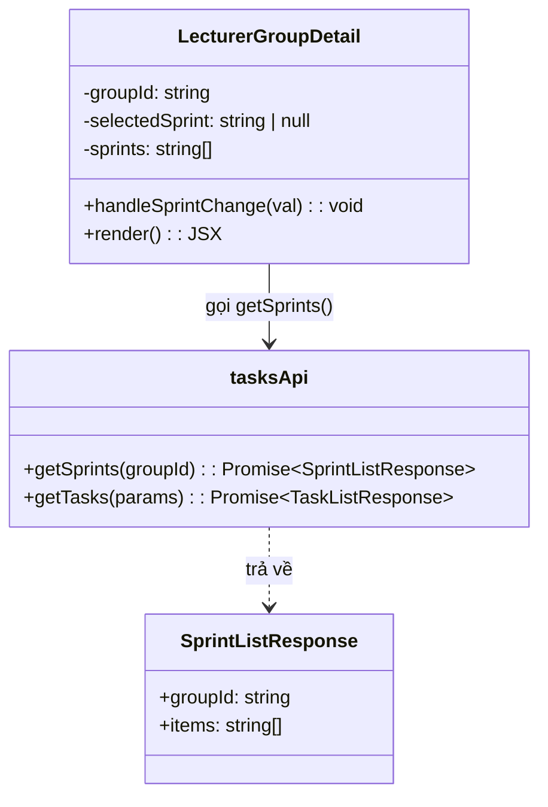
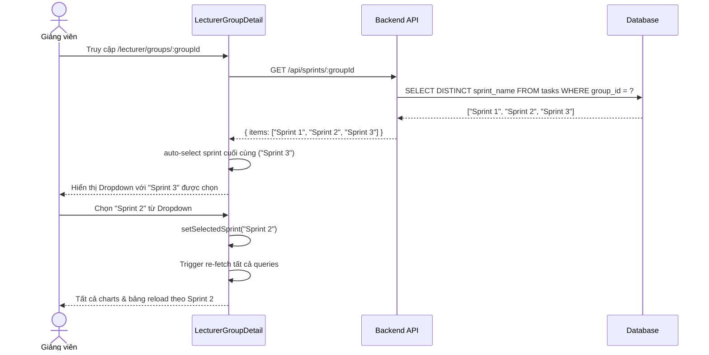
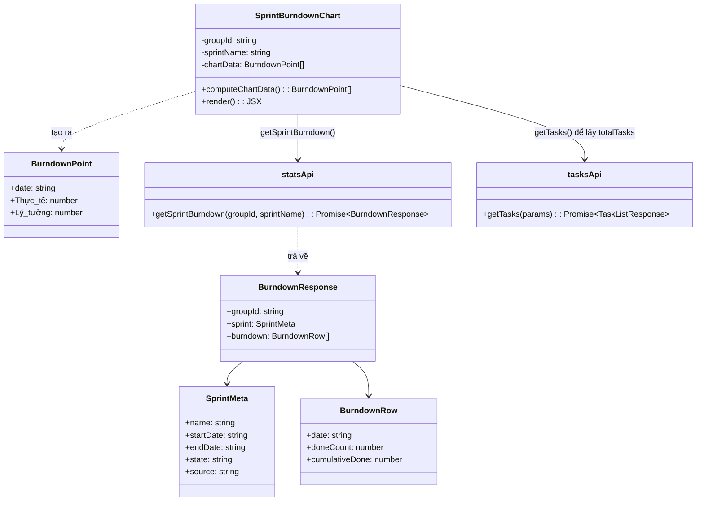
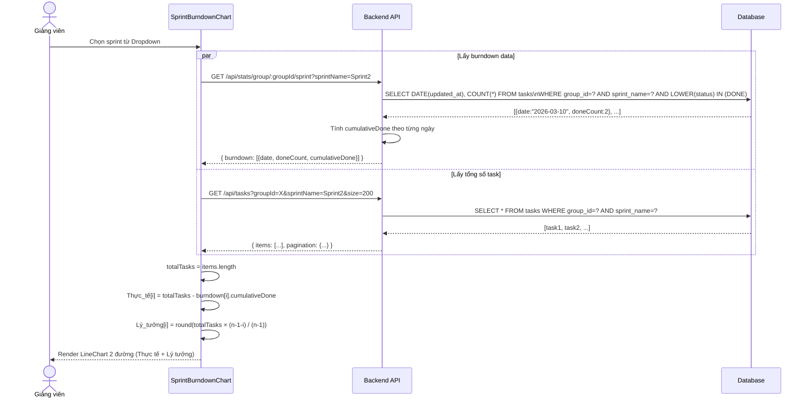
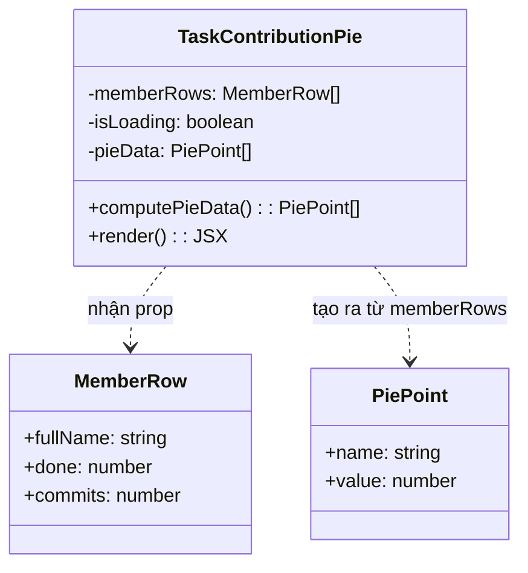
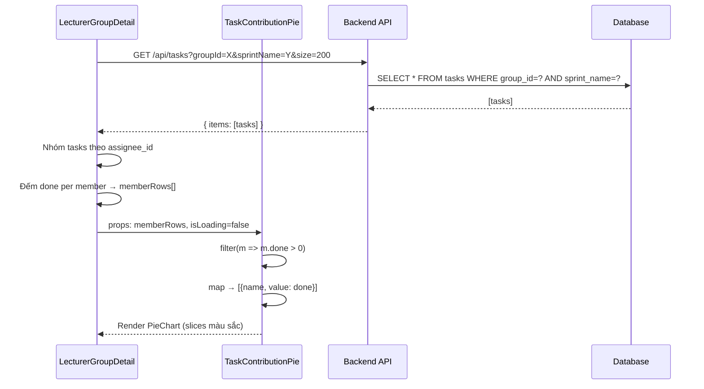
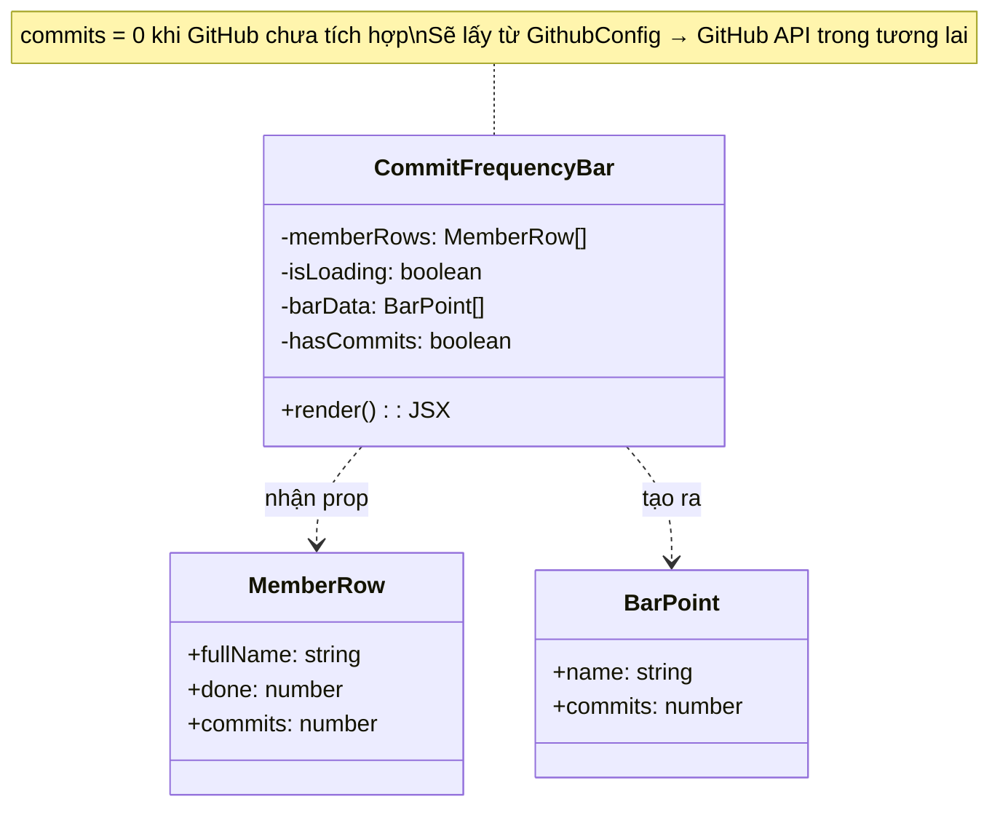
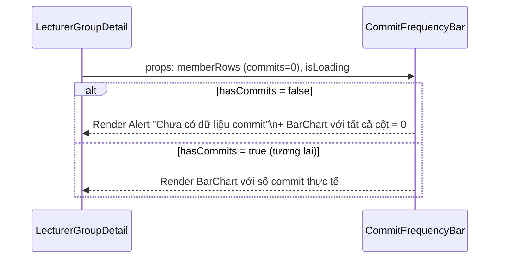
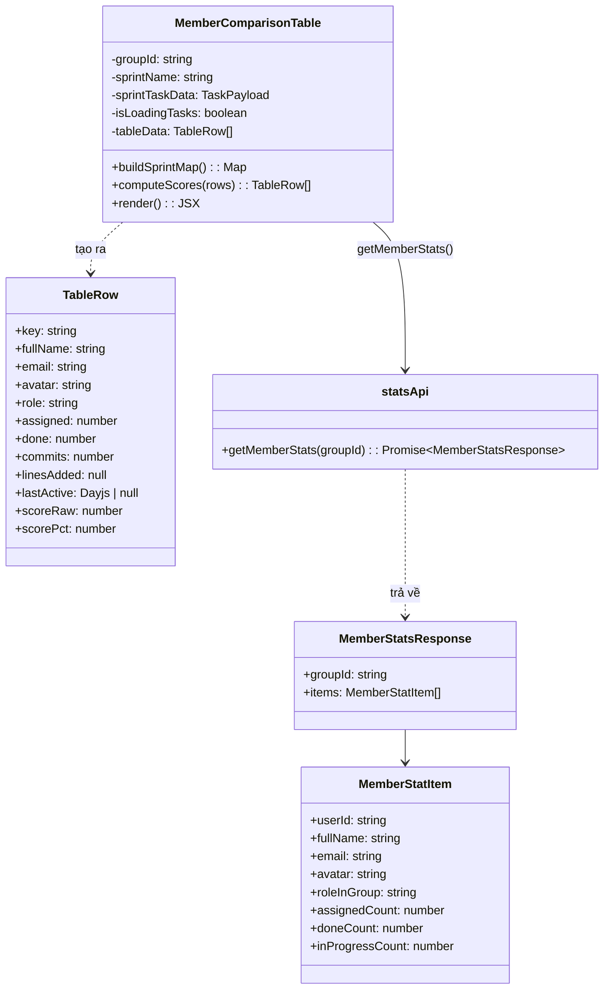
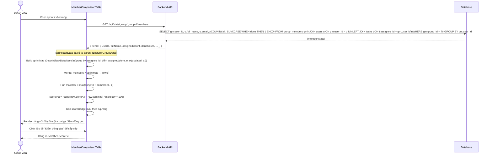

# CHS-22 — Dashboard Giảng Viên: Biểu Đồ Tiến Độ, Commit & Thống Kê Đóng Góp

> **Mã tính năng:** CHS-22  
> **Module:** Dashboard Giảng Viên (Lecturer)  
> **Phiên bản:** 1.0  
> **Ngày:** 27/03/2026  
> **Tác giả:** Nhóm Phát Triển

---

## Định Nghĩa & Thuật Ngữ Viết Tắt

| Thuật ngữ | Giải thích |
|---|---|
| SRS | Software Requirement Specification — Đặc tả yêu cầu phần mềm |
| SDD | Software Design Description — Mô tả thiết kế phần mềm |
| API | Application Programming Interface — Giao diện lập trình ứng dụng |
| UI | User Interface — Giao diện người dùng |
| GV | Giảng viên (Lecturer) |
| Sprint | Chu kỳ phát triển Agile (thường 1–2 tuần) |
| Burndown | Biểu đồ thể hiện lượng công việc còn lại theo từng ngày trong sprint |
| Task Done | Công việc đã hoàn thành (status: done / closed / resolved / complete / completed) |
| Task Assigned | Công việc được giao cho thành viên |
| Điểm đóng góp | Chỉ số ước tính mức độ đóng góp của thành viên: (task_done × 3 + commits × 1) / max |
| Recharts | Thư viện vẽ biểu đồ JavaScript cho React |
| dayjs | Thư viện xử lý ngày tháng nhẹ cho JavaScript |

---

## Mục Lục

1. [III. Đặc Tả Yêu Cầu Phần Mềm (SRS)](#iii-đặc-tả-yêu-cầu-phần-mềm-srs)
   - 3.1 Tổng quan màn hình
   - 3.2 Bộ lọc Sprint
   - 3.3 Biểu đồ Burndown Sprint
   - 3.4 Biểu đồ Tròn đóng góp Task
   - 3.5 Biểu đồ Tần suất Commit
   - 3.6 Bảng so sánh thành viên
   - 3.7 Điểm đóng góp ước tính
   - 3.8 Yêu cầu phi chức năng
2. [IV. Mô Tả Thiết Kế Phần Mềm (SDD)](#iv-mô-tả-thiết-kế-phần-mềm-sdd)
   - 4.1 Kiến trúc hệ thống
   - 4.2 Thiết kế cơ sở dữ liệu liên quan
   - 4.3 Thiết kế API
   - 4.4 Thiết kế chi tiết (Class Diagram + Sequence Diagram)
3. [VI. Gói Phát Hành & Hướng Dẫn Sử Dụng](#vi-gói-phát-hành--hướng-dẫn-sử-dụng)

---

## III. Đặc Tả Yêu Cầu Phần Mềm (SRS)

### 3.1 Tổng Quan Màn Hình

#### 3.1.1 Sơ Đồ Luồng Màn Hình

```
[Dashboard Giảng Viên]
        │
        ▼
[Danh sách nhóm phụ trách]
        │
        ▼ (click "Xem chi tiết")
[Chi tiết nhóm — CHS-22]
        │
        ├──► [Thanh tổng quan: Task done / Ngày còn lại / % hoàn thành]
        │
        ├──► [Bộ lọc Sprint (Dropdown)]
        │         │
        │         └──► Thay đổi sprint → tất cả charts cập nhật
        │
        ├──► [Sprint Burndown Chart (LineChart)]
        │
        ├──► [Task Contribution Pie Chart (PieChart)]
        │
        ├──► [Commit Frequency Bar Chart (BarChart)]
        │
        ├──► [Bảng so sánh thành viên (Table)]
        │         └── Tên | Task giao | Task done | Commits | Lines added | Last active | Điểm đóng góp
        │
        └──► [Kanban Board (chỉ xem)]
```

#### 3.1.2 Mô Tả Màn Hình

| # | Tính năng | Màn hình | Mô tả |
|---|---|---|---|
| 1 | Bộ lọc Sprint | Chi tiết nhóm | Dropdown chọn sprint; khi thay đổi toàn bộ charts và bảng được reload theo sprint đó |
| 2 | Sprint Burndown Chart | Chi tiết nhóm | Biểu đồ đường thể hiện số task còn lại mỗi ngày so với đường lý tưởng |
| 3 | Task Contribution Pie | Chi tiết nhóm | Biểu đồ tròn thể hiện tỷ lệ đóng góp task done của từng thành viên |
| 4 | Commit Frequency Bar | Chi tiết nhóm | Biểu đồ cột thể hiện số commit của từng thành viên trong sprint |
| 5 | Bảng so sánh thành viên | Chi tiết nhóm | Bảng đầy đủ các chỉ số đóng góp của từng thành viên, có thể sắp xếp |
| 6 | Điểm đóng góp ước tính | Chi tiết nhóm | Badge màu hiển thị mức độ đóng góp: Xuất sắc / Tốt / Trung bình / Cần cải thiện |

#### 3.1.3 Phân Quyền Màn Hình

| Màn hình | Admin | Giảng viên | Leader | Member |
|---|:---:|:---:|:---:|:---:|
| Dashboard Giảng viên | ✗ | ✓ | ✗ | ✗ |
| Chi tiết nhóm — Charts | ✗ | ✓ | ✗ | ✗ |
| Xem Kanban Board (chỉ xem) | ✗ | ✓ | ✗ | ✗ |
| Xuất báo cáo (tuần 6) | ✗ | ✓ | ✗ | ✗ |

---

### 3.2 Bộ Lọc Sprint

- **Role:** Giảng viên (Lecturer)

- **Function trigger:**  
  Giảng viên đăng nhập → điều hướng đến "Dashboard Giảng viên" → chọn nhóm → nhấn "Xem chi tiết" → trang Chi tiết nhóm hiển thị Dropdown "Sprint"

- **Mô tả chức năng:**
  - **Mục đích:** Cho phép giảng viên lọc toàn bộ dữ liệu hiển thị (charts, bảng, kanban) theo một sprint cụ thể.
  - **Giao diện:** Dropdown Select (Ant Design), hiển thị danh sách sprint trích xuất từ database. Sprint mới nhất được tự động chọn khi trang tải xong.
  - **Xử lý dữ liệu:** Khi giảng viên chọn sprint, frontend gọi lại tất cả các API với tham số `sprintName`, toàn bộ charts và bảng re-render theo dữ liệu mới.

- **Chi tiết chức năng:**
  - **Validation:**
    - Danh sách sprint phải được tải trước khi giảng viên tương tác.
    - Nếu không có sprint nào, dropdown hiển thị placeholder "Chọn sprint".
  - **Business Rules:**
    - Sprint mới nhất (theo thứ tự alphabet) được tự động chọn khi vào trang.
    - Cho phép xóa lựa chọn (allowClear) → khi xóa, hệ thống hiển thị tất cả task không lọc sprint.
    - Một lần chỉ chọn được một sprint.
  - **Normal Case:**
    - Giảng viên vào trang → hệ thống tự động chọn sprint mới nhất → tất cả charts hiển thị dữ liệu của sprint đó.
    - Giảng viên chọn sprint khác → tất cả charts, bảng, kanban cập nhật tức thì.
  - **Abnormal Case:**
    - Nhóm chưa có sprint nào → dropdown trống, charts hiển thị trạng thái rỗng với thông báo phù hợp.
    - Lỗi API → dropdown trống, charts hiển thị empty state.

---

### 3.3 Biểu Đồ Burndown Sprint (Sprint Burndown Chart)

- **Role:** Giảng viên (Lecturer)

- **Function trigger:**  
  Giảng viên chọn sprint từ Dropdown → biểu đồ Burndown tự động cập nhật

- **Mô tả chức năng:**
  - **Mục đích:** Thể hiện trực quan tiến độ hoàn thành công việc trong sprint. Giảng viên dùng để đánh giá nhóm có đang đi đúng kế hoạch không.
  - **Giao diện:** Biểu đồ đường (LineChart — Recharts) với:
    - Trục X: ngày (định dạng DD/MM)
    - Trục Y: số task còn lại (số nguyên không âm)
    - Đường **Thực tế** (màu xanh `#1677ff`): số task chưa done mỗi ngày
    - Đường **Lý tưởng** (màu xám `#bfbfbf`, nét đứt): đường giảm tuyến tính từ tổng task về 0
    - Tooltip khi hover hiển thị giá trị cả 2 đường
  - **Xử lý dữ liệu:**
    - Gọi `GET /api/stats/group/:groupId/sprint?sprintName=X` → nhận mảng `burndown[{date, doneCount, cumulativeDone}]`
    - Gọi `GET /api/tasks?groupId=X&sprintName=X&size=200` → lấy `totalTasks`
    - Tính: `Thực tế[ngày] = totalTasks − cumulativeDone[ngày]`
    - Tính: `Lý tưởng[ngày] = round(totalTasks × (n−1−idx) / (n−1))`

- **Chi tiết chức năng:**
  - **Validation:**
    - Phải chọn sprint thì biểu đồ mới hiển thị (enabled: `!!sprintName`).
    - Dữ liệu burndown phải là mảng không rỗng.
  - **Business Rules:**
    - Ngày của trục X tuân theo khoảng `startDate → endDate` của sprint.
    - Task được tính là "done" khi status thuộc: `done, closed, resolved, complete, completed`.
    - Đường Lý tưởng giảm đều từ ngày đầu đến ngày cuối sprint.
  - **Normal Case:**
    - Sprint được chọn, có dữ liệu → biểu đồ hiển thị 2 đường.
    - Đường Thực tế nằm dưới đường Lý tưởng → nhóm đang làm tốt hơn kế hoạch.
    - Đường Thực tế nằm trên đường Lý tưởng → nhóm đang trễ tiến độ.
  - **Abnormal Case:**
    - Sprint chưa được chọn → hiển thị thông báo "Chọn sprint để xem biểu đồ burndown".
    - Sprint được chọn nhưng không có dữ liệu → hiển thị Empty "Không có dữ liệu burndown cho sprint này".
    - Đang tải → hiển thị Skeleton (placeholder loading animation).

---

### 3.4 Biểu Đồ Tròn Đóng Góp Task (Task Contribution Pie Chart)

- **Role:** Giảng viên (Lecturer)

- **Function trigger:**  
  Giảng viên chọn sprint → biểu đồ tròn tự động cập nhật theo sprint đó

- **Mô tả chức năng:**
  - **Mục đích:** Thể hiện trực quan tỷ lệ đóng góp hoàn thành task của từng thành viên trong nhóm. Giảng viên dùng để nhanh chóng nhận diện thành viên đóng góp nhiều nhất/ít nhất.
  - **Giao diện:** Biểu đồ tròn (PieChart — Recharts) với:
    - Mỗi slice (lát cắt) = 1 thành viên
    - Kích thước slice tỷ lệ với số task done của thành viên đó
    - Nhãn hiển thị trực tiếp: `"Tên: X task"`
    - 8 màu xoay vòng (PIE_COLORS): `#1677ff, #52c41a, #fa8c16, #eb2f96, #722ed1, #13c2c2, #f5222d, #fadb14`
    - Tooltip hover: "X task — Hoàn thành"
  - **Xử lý dữ liệu:**
    - Dữ liệu lấy từ `memberRows` — được tính từ danh sách task của sprint (`/api/tasks?groupId=X&sprintName=Y`)
    - Mỗi `memberRow.done` = số task có `status ∈ DONE_STATUSES` và `assignee_id = userId`
    - Chỉ hiển thị thành viên có `done > 0`

- **Chi tiết chức năng:**
  - **Validation:**
    - Chỉ hiển thị slice cho thành viên đã complete ít nhất 1 task.
    - Nếu tất cả thành viên có done = 0 → hiển thị Empty "Chưa có task hoàn thành".
  - **Business Rules:**
    - Dữ liệu được lọc theo sprint hiện tại nếu sprint được chọn.
    - Khi không chọn sprint → dùng tổng tất cả task của nhóm.
  - **Normal Case:**
    - Sprint có task done → biểu đồ tròn hiển thị với các slice màu sắc phân biệt.
    - Hover vào slice → tooltip hiển thị tên thành viên và số task done.
  - **Abnormal Case:**
    - Chưa có task done trong sprint → Empty state.
    - Đang tải → Skeleton loading.

---

### 3.5 Biểu Đồ Tần Suất Commit (Commit Frequency Bar Chart)

- **Role:** Giảng viên (Lecturer)

- **Function trigger:**  
  Giảng viên chọn sprint → biểu đồ cột hiển thị số commit theo từng thành viên

- **Mô tả chức năng:**
  - **Mục đích:** Thể hiện mức độ hoạt động code của từng thành viên thông qua số lần commit GitHub trong sprint. Hỗ trợ giảng viên đánh giá sự tham gia thực tế vào phát triển phần mềm.
  - **Giao diện:** Biểu đồ cột (BarChart — Recharts) với:
    - Trục X: tên thành viên (nghiêng -20°)
    - Trục Y: số commit (số nguyên)
    - Cột màu tím `#722ed1`, bo góc trên
    - Khi GitHub chưa được cấu hình: hiển thị `Alert` thông tin bên trên biểu đồ
  - **Xử lý dữ liệu:**
    - Commits được lấy từ trường `commits` trong `memberRows`
    - Hiện tại: commits = 0 (GitHub API chưa tích hợp)
    - Khi GitHub được cấu hình: lấy từ `GithubConfig` → GitHub REST API → đếm commits theo sprint dates

- **Chi tiết chức năng:**
  - **Validation:**
    - Biểu đồ luôn được hiển thị kể cả khi commits = 0.
    - Khi không có dữ liệu commit thực → Alert thông báo "Chưa có dữ liệu commit / Tính năng đồng bộ GitHub chưa được cấu hình".
  - **Business Rules:**
    - Commits được tính trong phạm vi ngày bắt đầu và kết thúc sprint.
    - Mỗi cột tương ứng 1 thành viên đang có trong nhóm tại thời điểm xem.
  - **Normal Case:**
    - GitHub được cấu hình → biểu đồ cột hiển thị số commit thực tế cho từng thành viên.
    - Hover vào cột → tooltip "X Commits".
  - **Abnormal Case:**
    - GitHub chưa cấu hình → Alert info + cột commits = 0 cho tất cả.
    - Đang tải → Skeleton loading.

---

### 3.6 Bảng So Sánh Thành Viên (Member Comparison Table)

- **Role:** Giảng viên (Lecturer)

- **Function trigger:**  
  Giảng viên chọn sprint → bảng cập nhật dữ liệu theo sprint; giảng viên click tiêu đề cột để sắp xếp

- **Mô tả chức năng:**
  - **Mục đích:** Cung cấp cái nhìn tổng hợp đầy đủ về đóng góp từng thành viên trong một bảng duy nhất. Đây là công cụ chính để giảng viên đánh giá điểm.
  - **Giao diện:** Bảng Ant Design Table với các cột:

    | Cột | Mô tả | Sắp xếp |
    |---|---|---|
    | Thành viên | Avatar + Tên đầy đủ + Email | ✗ |
    | Task giao | Số task được assign | ✓ |
    | Task done | Số task có status done | ✓ |
    | Commits | Số commit GitHub (0 nếu chưa tích hợp) | ✗ |
    | Lines added | Số dòng code thêm mới (N/A chưa tích hợp) | ✗ |
    | Last active | Thời điểm cập nhật task gần nhất (DD/MM HH:mm) | ✓ |
    | Điểm đóng góp | Badge màu + Progress bar theo % | ✓ (mặc định giảm dần) |

  - **Xử lý dữ liệu:**
    - Kết hợp dữ liệu từ 2 nguồn:
      1. `GET /api/stats/group/:groupId/members` → thông tin cơ bản thành viên (fullName, email, avatar, role)
      2. Task list của sprint → tính assigned, done, lastActive per-member
    - Tính điểm: `maxRaw = max(task_done × 3 + commits × 1)` → `scorePct = round((score / maxRaw) × 100)`
    - `lastActive = max(updated_at)` trong các task được giao

- **Chi tiết chức năng:**
  - **Validation:**
    - Thành viên không được giao task vẫn hiển thị với assigned=0, done=0.
    - `lastActive` hiển thị `—` nếu không có task nào trong sprint.
  - **Business Rules:**
    - Khi sprint được chọn: dữ liệu assigned/done/lastActive tính từ task của sprint đó.
    - Khi không chọn sprint: dùng dữ liệu tổng hợp từ API `getMemberStats`.
    - Điểm đóng góp được quy chuẩn về 100% dựa trên người đóng góp nhiều nhất (không phải điểm tuyệt đối).
    - Commits và Lines added = N/A cho đến khi GitHub được tích hợp; Tooltip giải thích lý do.
  - **Normal Case:**
    - Bảng hiển thị đầy đủ tất cả thành viên nhóm.
    - Sắp xếp theo "Điểm đóng góp" giảm dần theo mặc định.
    - Giảng viên click tiêu đề "Task done" → sắp xếp lại theo số task done.
  - **Abnormal Case:**
    - Không có dữ liệu thành viên → bảng rỗng với Loading indicator.
    - Lỗi API `getMemberStats` → bảng rỗng.

---

### 3.7 Điểm Đóng Góp Ước Tính

- **Role:** Giảng viên (Lecturer)

- **Function trigger:**  
  Tự động tính toán khi bảng so sánh thành viên tải xong dữ liệu

- **Mô tả chức năng:**
  - **Mục đích:** Cung cấp chỉ số định lượng khách quan để giảng viên tham khảo khi cho điểm thành viên.
  - **Giao diện:** Badge màu + Progress bar trong cột "Điểm đóng góp" của bảng, với tooltip giải thích công thức.
  - **Công thức tính điểm:**

    $$\text{score\_raw} = (\text{task\_done} \times 3) + (\text{commits} \times 1)$$

    $$\text{score\_pct} = \left\lfloor \frac{\text{score\_raw}}{\max(\text{score\_raw trên toàn nhóm})} \times 100 \right\rceil$$

  - **Quy tắc màu badge:**

    | Mức điểm | Màu | Nhãn |
    |---|---|---|
    | ≥ 80% | Xanh lá `#52c41a` | Xuất sắc |
    | ≥ 60% | Xanh dương `#1677ff` | Tốt |
    | ≥ 40% | Cam `#fa8c16` | Trung bình |
    | < 40% | Đỏ `#f5222d` | Cần cải thiện |

  - **Xử lý dữ liệu:** Tính toán hoàn toàn phía frontend từ dữ liệu task + commits đã có.

- **Chi tiết chức năng:**
  - **Validation:**
    - `maxRaw` được đảm bảo ≥ 1 để tránh chia cho 0: `Math.max(...scores, 1)`.
    - Thành viên có score_pct luôn trong khoảng [0, 100].
  - **Business Rules:**
    - Điểm là **tương đối**: thành viên đóng góp nhiều nhất trong nhóm luôn đạt 100%, không phải điểm tuyệt đối.
    - Khi chưa có GitHub: commits = 0, điểm chỉ tính từ task_done.
    - Trọng số task_done (×3) cao hơn commits (×1) vì task done là kết quả cụ thể, đo lường trực tiếp.
  - **Normal Case:**
    - Hiển thị badge với màu + % + nhãn và progress bar phía dưới.
    - Tooltip "Công thức: (task_done × 3 + commits × 1) / max" khi hover vào tiêu đề cột.
  - **Abnormal Case:**
    - Tất cả thành viên có score_raw = 0 → tất cả scorePct = 0, badge "Cần cải thiện".

---

### 3.8 Yêu Cầu Phi Chức Năng

| # | Loại | Yêu cầu |
|---|---|---|
| NFR-01 | Hiệu suất | Tất cả charts phải render trong vòng < 1 giây sau khi nhận dữ liệu API |
| NFR-02 | Hiệu suất | Cache dữ liệu API 60 giây (staleTime) để tránh re-fetch không cần thiết |
| NFR-03 | Giao diện | Responsive tại màn hình 1280px: Burndown (58%) + Pie (42%) nằm ngang; Commit Bar full width |
| NFR-04 | Giao diện | Hiển thị Skeleton loading placeholder trong khi đang fetch để trải nghiệm người dùng mượt mà |
| NFR-05 | Khả dụng | Khi API lỗi, hiển thị Empty state với thông báo rõ ràng, không crash trang |
| NFR-06 | Bảo mật | Tất cả API call phải có JWT Bearer token; giảng viên chỉ xem được nhóm mình phụ trách |
| NFR-07 | Khả năng mở rộng | Thiết kế tách biệt từng component chart để dễ thêm dữ liệu GitHub trong tương lai |

---

## IV. Mô Tả Thiết Kế Phần Mềm (SDD)

### 4.1 Kiến Trúc Hệ Thống

#### 4.1.1 Frontend

| Thư mục / File | Mô tả |
|---|---|
| `src/pages/lecturer/LecturerGroupDetail.jsx` | Component chính của CHS-22; chứa toàn bộ logic và layout |
| `src/pages/lecturer/LecturerDashboard.jsx` | Dashboard tổng quan; điều hướng vào LecturerGroupDetail |
| `src/api/tasksApi.js` | Định nghĩa các hàm gọi API: `tasksApi`, `statsApi` |
| `src/api/axiosClient.js` | Axios instance với interceptor JWT auto-refresh |
| `src/auth/AuthContext.jsx` | Context lưu thông tin người dùng hiện tại |

#### 4.1.2 Backend

| Thư mục / File | Mô tả |
|---|---|
| `src/routes/tasks.routes.js` | Định nghĩa route; tất cả route được bảo vệ bởi middleware `auth` |
| `src/controllers/tasks.controller.js` | Logic xử lý: burndown, member stats, sprint list, task list |
| `src/models/task.model.js` | Sequelize model cho bảng `tasks` |
| `src/models/groupMember.model.js` | Sequelize model cho bảng `group_members` |
| `src/models/group.model.js` | Sequelize model cho bảng `groups` |
| `src/middleware/auth.js` | Xác thực JWT và gắn `req.user` |

#### 4.1.3 Công Nghệ Sử Dụng

| Công nghệ | Phiên bản | Mục đích |
|---|---|---|
| React | 19.2.4 | Framework frontend |
| Ant Design | 6.3.3 | Component UI (Card, Table, Select, Badge...) |
| Recharts | ~2.x | Vẽ biểu đồ LineChart, PieChart, BarChart |
| dayjs | 1.11.20 | Xử lý và định dạng ngày tháng |
| @tanstack/react-query | 5.x | Fetch, cache, và sync dữ liệu server |
| Node.js / Express | - | Backend API |
| Sequelize | - | ORM tương tác database |
| MySQL | - | Cơ sở dữ liệu quan hệ |

---

### 4.2 Thiết Kế Cơ Sở Dữ Liệu Liên Quan

#### 4.2.1 Bảng `tasks`

| Tên cột | Kiểu | Mô tả | Khóa |
|---|---|---|---|
| id | CHAR(36) | Định danh duy nhất (UUID) | PK |
| group_id | CHAR(36) | Nhóm sở hữu task | FK → groups.id |
| jira_key | VARCHAR(50) | Mã task trên Jira (e.g. `PROJ-123`) | UNIQUE(group_id, jira_key) |
| jira_issue_id | VARCHAR(50) | ID nội bộ Jira | — |
| title | TEXT | Tiêu đề task | — |
| status | VARCHAR(100) | Trạng thái: `To Do, In Progress, Done,...` | — |
| priority | VARCHAR(50) | Độ ưu tiên: `Highest, High, Medium, Low, Lowest` | — |
| assignee_id | CHAR(36) | ID người được giao | FK → users.id |
| assignee_email | VARCHAR(255) | Email người được giao (cache) | — |
| sprint_name | VARCHAR(255) | Tên sprint | — |
| story_points | FLOAT | Story points (độ phức tạp ước tính) | — |
| due_date | DATE | Ngày hạn hoàn thành | — |
| created_at | DATETIME | Ngày tạo | — |
| updated_at | DATETIME | Ngày cập nhật gần nhất | — |

#### 4.2.2 Bảng `groups`

| Tên cột | Kiểu | Mô tả | Khóa |
|---|---|---|---|
| id | CHAR(36) | Định danh duy nhất (UUID) | PK |
| name | VARCHAR(255) | Tên nhóm | — |
| description | TEXT | Mô tả nhóm | — |
| semester | VARCHAR(255) | Kỳ học (e.g. `SP25`) | — |
| created_by | CHAR(36) | ID người tạo nhóm | FK → users.id |
| is_active | TINYINT | Trạng thái: 1=đang hoạt động, 0=ngừng | — |
| created_at | DATETIME | Ngày tạo | — |
| updated_at | DATETIME | Ngày cập nhật | — |

#### 4.2.3 Bảng `group_members`

| Tên cột | Kiểu | Mô tả | Khóa |
|---|---|---|---|
| id | CHAR(36) | Định danh duy nhất (UUID) | PK |
| group_id | CHAR(36) | Nhóm | FK → groups.id |
| user_id | CHAR(36) | Thành viên | FK → users.id |
| role_in_group | ENUM | Vai trò: `LEADER, MEMBER, VIEWER` | — |
| joined_at | DATETIME | Ngày tham gia | — |

---

### 4.3 Thiết Kế API

| Phương thức | Endpoint | Mô tả | Auth |
|---|---|---|---|
| GET | `/api/sprints/:groupId` | Lấy danh sách sprint của nhóm | Bearer JWT |
| GET | `/api/tasks?groupId=X&sprintName=Y&size=200` | Lấy danh sách task theo nhóm/sprint | Bearer JWT |
| GET | `/api/stats/group/:groupId/sprint?sprintName=X` | Lấy dữ liệu burndown sprint | Bearer JWT |
| GET | `/api/stats/group/:groupId/members` | Lấy thống kê task của từng thành viên | Bearer JWT |
| GET | `/api/stats/group/:groupId/overview` | Lấy tổng quan nhóm (completion rate, daysLeft) | Bearer JWT |

#### Ví Dụ Response — Burndown API

```json
{
  "groupId": "abc-123",
  "sprint": {
    "name": "Sprint 2",
    "startDate": "2026-03-10",
    "endDate": "2026-03-23",
    "state": "active",
    "source": "task-history"
  },
  "burndown": [
    { "date": "2026-03-10", "doneCount": 0, "cumulativeDone": 0 },
    { "date": "2026-03-11", "doneCount": 2, "cumulativeDone": 2 },
    { "date": "2026-03-12", "doneCount": 1, "cumulativeDone": 3 }
  ]
}
```

#### Ví Dụ Response — Member Stats API

```json
{
  "groupId": "abc-123",
  "items": [
    {
      "userId": "user-001",
      "fullName": "Nguyễn Văn A",
      "email": "a@fpt.edu.vn",
      "avatar": null,
      "roleInGroup": "LEADER",
      "assignedCount": 8,
      "doneCount": 6,
      "inProgressCount": 2
    }
  ]
}
```

---

### 4.4 Thiết Kế Chi Tiết

#### 4.4.1 Bộ Lọc Sprint

##### 4.4.1.1 Class Diagram



##### 4.4.1.2 Sequence Diagram



---

#### 4.4.2 Sprint Burndown Chart

##### 4.4.2.1 Class Diagram



##### 4.4.2.2 Sequence Diagram



---

#### 4.4.3 Biểu Đồ Tròn Đóng Góp Task

##### 4.4.3.1 Class Diagram



##### 4.4.3.2 Sequence Diagram



---

#### 4.4.4 Biểu Đồ Tần Suất Commit

##### 4.4.4.1 Class Diagram



##### 4.4.4.2 Sequence Diagram



---

#### 4.4.5 Bảng So Sánh Thành Viên & Điểm Đóng Góp

##### 4.4.5.1 Class Diagram



##### 4.4.5.2 Sequence Diagram



---

## VI. Gói Phát Hành & Hướng Dẫn Sử Dụng

### 1. Gói Phát Hành (Deliverable Package)

| # | Hạng mục | Mô tả |
|---|---|---|
| 1 | Source Code Frontend | `frontend/src/pages/lecturer/LecturerGroupDetail.jsx` — Component chính CHS-22 |
| 2 | Source Code Frontend | `frontend/src/pages/lecturer/LecturerDashboard.jsx` — Dashboard danh sách nhóm |
| 3 | Source Code Frontend | `frontend/src/api/tasksApi.js` — Định nghĩa `tasksApi`, `statsApi` |
| 4 | Source Code Backend | `backend/src/controllers/tasks.controller.js` — Xử lý burndown, member stats, sprint list |
| 5 | Source Code Backend | `backend/src/routes/tasks.routes.js` — Định nghĩa routes |
| 6 | Dependency mới | `recharts ^2.x` — Thêm vào `frontend/package.json` |
| 7 | Tài liệu | File tài liệu này (`docs/CHS-22_Dashboard_Lecturer_Charts.md`) |

### 2. Hướng Dẫn Cài Đặt

#### 2.1 Yêu Cầu Hệ Thống

| Thành phần | Tối thiểu | Khuyến nghị |
|---|---|---|
| Trình duyệt | Chrome 110+ / Firefox 110+ | Chrome phiên bản mới nhất |
| Độ phân giải | 1024 × 768 | 1280 × 800 trở lên |
| Kết nối mạng | 10 Mbps | 50 Mbps |

#### 2.2 Cài Đặt Dependency Mới

```
Bước 1: Mở terminal trong thư mục frontend
Bước 2: Gõ lệnh: npm install recharts
Bước 3: Kiểm tra package.json có dòng "recharts": "^2.x"
Bước 4: Khởi động lại dev server: npm run dev
```

### 3. Hướng Dẫn Sử Dụng

#### 3.1 Tổng Quan

Giảng viên sử dụng Dashboard Chi tiết nhóm để:
- Theo dõi tiến độ sprint của nhóm qua biểu đồ trực quan
- So sánh mức độ đóng góp của từng thành viên
- Tham khảo điểm đóng góp ước tính khi chấm điểm cuối kỳ

#### 3.2 Truy Cập Màn Hình Dashboard Chi Tiết Nhóm

- **Bước 1:** Đăng nhập vào hệ thống bằng tài khoản Giảng viên
- **Bước 2:** Hệ thống tự động điều hướng đến Dashboard Giảng viên — hiển thị danh sách các nhóm đang phụ trách
- **Bước 3:** Nhấn vào card nhóm muốn xem chi tiết → chọn nút **"Xem chi tiết"**
- **Bước 4:** Trang Chi tiết nhóm mở ra, tự động chọn sprint mới nhất

#### 3.3 Chọn Sprint Để Xem Biểu Đồ

- **Bước 1:** Nhìn vào phần **"Sprint:"** ở đầu trang, nhấn vào Dropdown
- **Bước 2:** Danh sách các sprint của nhóm xuất hiện (ví dụ: Sprint 1, Sprint 2, Sprint 3)
- **Bước 3:** Chọn sprint muốn phân tích — tất cả biểu đồ và bảng bên dưới cập nhật ngay lập tức
- **Bước 4:** Để xem tổng hợp tất cả sprint, nhấn nút **×** bên cạnh tên sprint để xóa lựa chọn

#### 3.4 Đọc Biểu Đồ Burndown Sprint

- **Bước 1:** Nhìn vào card **"Sprint Burndown Chart"** — bên trái trên màn hình
- **Bước 2:** Quan sát hai đường:
  - Đường **xanh (Thực tế)**: số task chưa xong mỗi ngày
  - Đường **xám đứt (Lý tưởng)**: đường kế hoạch giảm đều
- **Bước 3:** Di chuột vào bất kỳ ngày nào trên biểu đồ → tooltip hiển thị số liệu cụ thể
- **Bước 4:** Đánh giá:
  - Đường Thực tế **nằm dưới** đường Lý tưởng → nhóm **đang làm sớm hơn kế hoạch** ✓
  - Đường Thực tế **nằm trên** đường Lý tưởng → nhóm **đang trễ tiến độ** ✗

#### 3.5 Đọc Biểu Đồ Tròn Đóng Góp Task

- **Bước 1:** Nhìn vào card **"Đóng góp Task (Done)"** — bên phải, cùng hàng với Burndown
- **Bước 2:** Mỗi màu tương ứng một thành viên; kích thước lát cắt tỷ lệ với số task done
- **Bước 3:** Di chuột vào lát cắt → tooltip hiển thị tên thành viên và số task done
- **Bước 4:** Nhãn hiển thị trực tiếp trên biểu đồ theo dạng `"Tên: X task"`

#### 3.6 Đọc Biểu Đồ Tần Suất Commit

- **Bước 1:** Nhìn vào card **"Tần suất Commit theo thành viên"** bên dưới hai biểu đồ trên
- **Bước 2:** Mỗi cột màu tím tương ứng một thành viên; chiều cao cột = số commit trong sprint
- **Bước 3:** Di chuột vào cột → tooltip "X Commits"
- **Lưu ý:** Nếu xuất hiện thông báo màu xanh **"Chưa có dữ liệu commit"** → nhóm chưa cấu hình tích hợp GitHub. Liên hệ nhóm để cấu hình theo hướng dẫn quản trị.

#### 3.7 Sử Dụng Bảng So Sánh Thành Viên

- **Bước 1:** Kéo xuống phần **"Bảng so sánh đóng góp thành viên"**
- **Bước 2:** Bảng mặc định sắp xếp theo **"Điểm đóng góp"** giảm dần — thành viên đóng góp nhiều nhất ở trên cùng
- **Bước 3:** Để sắp xếp theo tiêu chí khác, nhấn vào tiêu đề cột:
  - **"Task giao"** → sắp xếp theo số task được phân công
  - **"Task done"** → sắp xếp theo số task đã hoàn thành
  - **"Last active"** → sắp xếp theo thời gian hoạt động gần nhất
- **Bước 4:** Đọc cột **"Điểm đóng góp"**:
  - Badge **🟢 Xuất sắc** (≥80%): thành viên có đóng góp xuất sắc so với cả nhóm
  - Badge **🔵 Tốt** (60–79%): đóng góp tốt
  - Badge **🟠 Trung bình** (40–59%): đóng góp trung bình
  - Badge **🔴 Cần cải thiện** (<40%): đóng góp thấp hơn mức trung bình của nhóm
- **Bước 5:** Hover vào tiêu đề cột "Điểm đóng góp" → tooltip hiển thị công thức tính điểm

#### 3.8 Xem Kanban Board (Chỉ Xem)

- **Bước 1:** Kéo xuống cuối trang đến section **"Kanban Board (Chỉ xem)"**
- **Bước 2:** 3 cột hiển thị: **To Do** (xanh nhạt) | **In Progress** (cam nhạt) | **Done** (xanh lá nhạt)
- **Bước 3:** Click vào card task để đọc chi tiết (tiêu đề, priority, story points, ngày hạn, người được giao)
- **Lưu ý:** Giảng viên chỉ có quyền **xem**; không thể kéo thả hay thay đổi trạng thái task

---

*Tài liệu này được viết dựa trên codebase thực tế tại `d:\CNPM\CNPM_HK2_SN` và tuân thủ định dạng tài liệu chuẩn Capstone Project (4551_SP25SE107_GSP46).*
