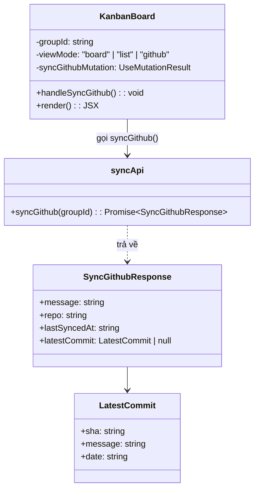
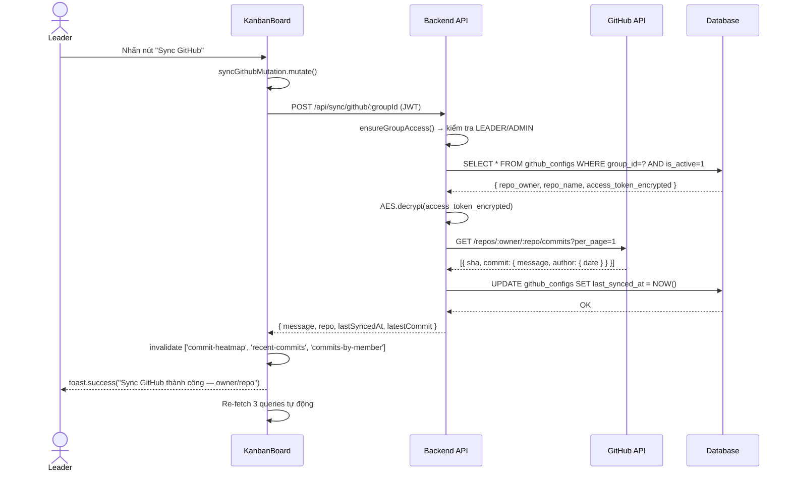
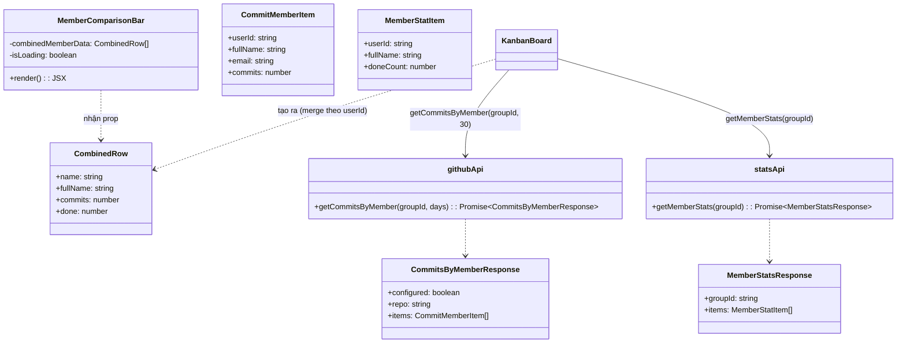
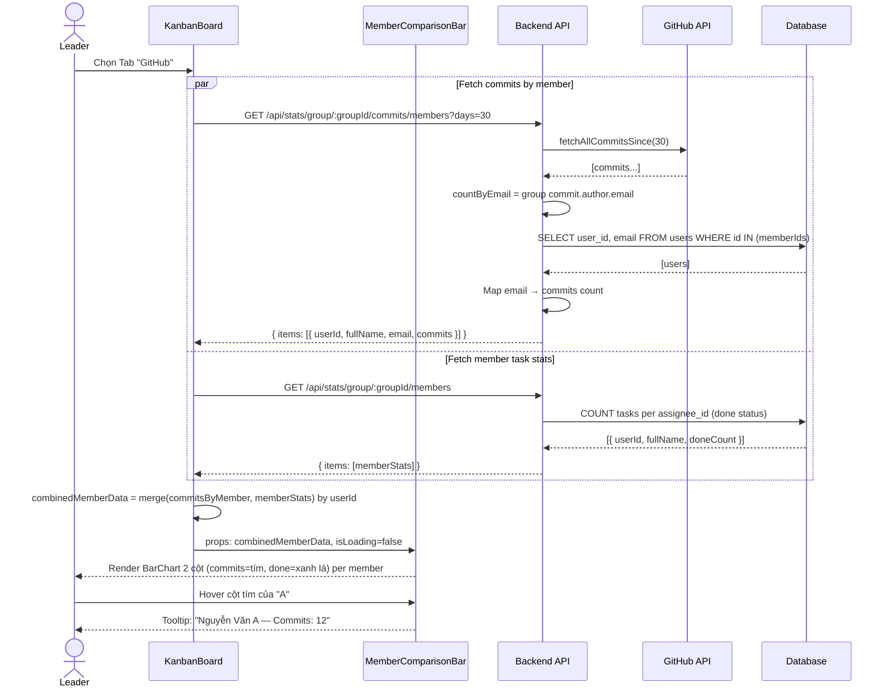
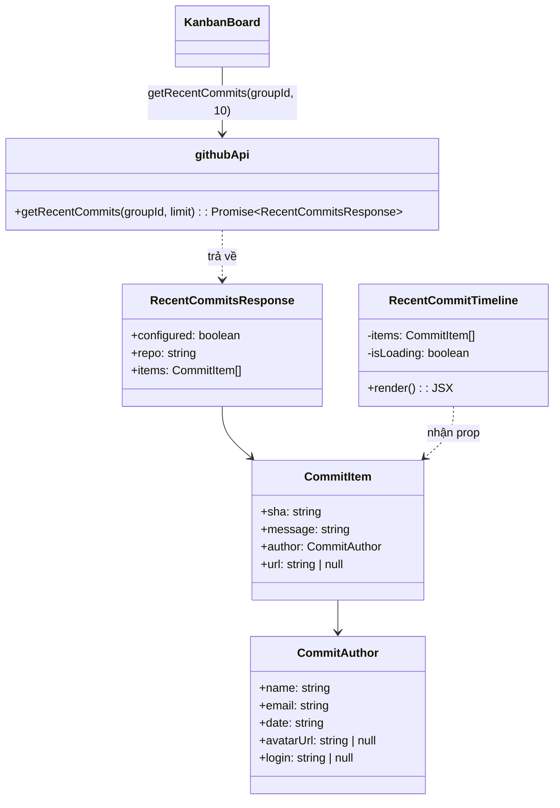
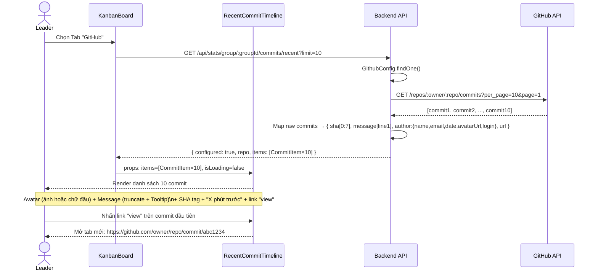

# CHS-23 — Dashboard Team Leader: Commit Heatmap & So Sánh Đóng Góp Thành Viên

> **Mã tính năng:** CHS-23  
> **Module:** Dashboard Team Leader (KanbanBoard — Tab GitHub)  
> **Phiên bản:** 1.0  
> **Ngày:** 27/03/2026  
> **Tác giả:** Nhóm Phát Triển

---

## Định Nghĩa & Thuật Ngữ Viết Tắt

| Thuật ngữ | Giải thích |
|---|---|
| SRS | Software Requirement Specification — Đặc tả yêu cầu phần mềm |
| SDD | Software Design Description — Mô tả thiết kế phần mềm |
| API | Application Programming Interface — Giao diện lập trình ứng dụng |
| UI | User Interface — Giao diện người dùng |
| Leader | Trưởng nhóm (role_in_group = LEADER) |
| Heatmap | Biểu đồ lưới thể hiện mật độ hoạt động bằng cách đổ màu đậm/nhạt |
| Commit | Một lần đẩy code lên repository GitHub |
| SHA | Mã định danh duy nhất của mỗi commit (40 ký tự hex, hiển thị 7 ký tự đầu) |
| Grouped Bar | Biểu đồ cột nhóm — mỗi nhóm cột tương ứng một thành viên, mỗi cột trong nhóm là một chỉ số khác nhau |
| AES | Advanced Encryption Standard — thuật toán mã hoá đối xứng dùng để bảo vệ access token GitHub |
| Personal Access Token | Token xác thực GitHub API, do người dùng tạo trên GitHub với quyền đọc repo |
| Recharts | Thư viện vẽ biểu đồ JavaScript cho React |
| dayjs | Thư viện xử lý ngày tháng nhẹ cho JavaScript |
| relativeTime | Plugin dayjs trả về khoảng thời gian tương đối (ví dụ: "3 phút trước") |
| staleTime | Thời gian cache của TanStack Query trước khi fetch lại dữ liệu |

---

## Mục Lục

1. [III. Đặc Tả Yêu Cầu Phần Mềm (SRS)](#iii-đặc-tả-yêu-cầu-phần-mềm-srs)
   - 3.1 Tổng quan màn hình
   - 3.2 Tab GitHub & Nút Sync GitHub
   - 3.3 Commit Activity Heatmap
   - 3.4 Biểu đồ So sánh đóng góp thành viên (Grouped Bar Chart)
   - 3.5 Timeline 10 Commit gần nhất
   - 3.6 Yêu cầu phi chức năng
2. [IV. Mô Tả Thiết Kế Phần Mềm (SDD)](#iv-mô-tả-thiết-kế-phần-mềm-sdd)
   - 4.1 Kiến trúc hệ thống
   - 4.2 Thiết kế cơ sở dữ liệu liên quan
   - 4.3 Thiết kế API
   - 4.4 Thiết kế chi tiết (Class Diagram + Sequence Diagram)
3. [VI. Gói Phát Hành & Hướng Dẫn Sử Dụng](#vi-gói-phát-hành--hướng-dẫn-sử-dụng)

---

## III. Đặc Tả Yêu Cầu Phần Mềm (SRS)

### 3.1 Tổng Quan Màn Hình

#### 3.1.1 Sơ Đồ Luồng Màn Hình

```
[KanbanBoard — /board/:groupId]
        │
        ├──► [Segmented Control]
        │         ├── Board  (mặc định)
        │         ├── List
        │         └── GitHub  ◄── CHS-23
        │
        └──► [Tab GitHub]
                  │
                  ├──► [Header: tên repo + Nút "Sync GitHub"]
                  │         └── Nhấn → POST /api/sync/github/:groupId → toast thành công/lỗi
                  │
                  ├──► [Commit Activity Heatmap]
                  │         └── Lưới 7 hàng × N cột (tuần)
                  │               └── Hover ô → tooltip: "X commits ngày YYYY-MM-DD"
                  │
                  └──► [Row 2 gồm 2 panel]
                            ├── [Grouped Bar Chart: Commits vs Task Done (per member)]
                            └── [Timeline: 10 commit gần nhất]
                                      └── Avatar + Message + SHA + Thời gian tương đối + Link
```

#### 3.1.2 Mô Tả Màn Hình

| # | Tính năng | Màn hình | Mô tả |
|---|---|---|---|
| 1 | Tab GitHub | Kanban Board | Tab thứ 3 trong Segmented Control; lazily fetch dữ liệu khi được chọn lần đầu |
| 2 | Nút Sync GitHub | Tab GitHub | Trigger kết nối GitHub API, cập nhật `last_synced_at`, làm mới toàn bộ queries |
| 3 | Commit Heatmap | Tab GitHub | Lưới đóng góp kiểu GitHub 90 ngày, mỗi ô = 1 ngày, đổ màu theo số commit |
| 4 | Grouped Bar Chart | Tab GitHub | Biểu đồ cột nhóm so sánh Commits (tím) và Task Done (xanh lá) từng thành viên |
| 5 | Recent Commits Timeline | Tab GitHub | Danh sách 10 commit mới nhất: avatar, message, SHA tag, thời gian tương đối, link GitHub |

#### 3.1.3 Phân Quyền Màn Hình

| Màn hình | Admin | Giảng viên | Leader | Member |
|---|:---:|:---:|:---:|:---:|
| Kanban Board | ✓ | ✗ | ✓ | ✓ |
| Tab GitHub (xem) | ✓ | ✗ | ✓ | ✓ |
| Nút Sync GitHub | ✓ | ✗ | ✓ | ✗ |

> **Ghi chú:** Member có thể thấy Tab GitHub và đọc dữ liệu nhưng không thể nhấn nút Sync GitHub (backend kiểm tra `role_in_group = LEADER` hoặc `role = ADMIN`).

---

### 3.2 Tab GitHub & Nút Sync GitHub

- **Role:** Leader, Admin

- **Function trigger:**  
  Leader vào `/board/:groupId` → nhấn tab **"GitHub"** trong Segmented Control → hệ thống tự động fetch dữ liệu lần đầu → nhấn nút **"Sync GitHub"** để refresh thủ công

- **Mô tả chức năng:**
  - **Mục đích:** Cung cấp điểm truy cập thống nhất cho toàn bộ thống kê GitHub của nhóm ngay trong màn hình Kanban Board hiện có, không cần điều hướng sang trang khác.
  - **Giao diện:**
    - Nút "Sync GitHub" màu xanh (`type="primary"`) với icon `SyncOutlined`, quay khi đang loading.
    - Header hiển thị tên repo dạng `owner/name` trong Tag màu xanh lá.
    - Khi GitHub chưa cấu hình: Alert info thông báo và yêu cầu liên hệ Admin.
  - **Xử lý dữ liệu:**
    - Nhấn nút → gọi `POST /api/sync/github/:groupId`
    - Backend kiểm tra `GithubConfig`, gọi GitHub API lấy 1 commit để xác nhận kết nối, cập nhật `last_synced_at`
    - Trả về `{ repo, lastSyncedAt, latestCommit }` → toast thành công
    - Invalidate 3 queryKey: `commit-heatmap`, `recent-commits`, `commits-by-member`

- **Chi tiết chức năng:**
  - **Validation:**
    - Backend từ chối nếu user không phải LEADER hoặc ADMIN (HTTP 403).
    - Backend trả lỗi 404 nếu `GithubConfig` không tồn tại hoặc `is_active = 0`.
  - **Business Rules:**
    - Dữ liệu GitHub chỉ được fetch khi `viewMode === 'github'` (lazy fetch — `enabled: !!groupId && viewMode === 'github'`).
    - Cache trong 60 giây (`staleTime: 60_000`) để tránh gọi API GitHub quá nhiều.
    - Sau khi sync thành công, 3 query heatmap/recent/commits-by-member bị invalidate và tự động re-fetch.
  - **Normal Case:**
    - GitHub đã cấu hình → header hiện `owner/repo`, toàn bộ analytics hiển thị đúng.
    - Nhấn Sync → spinner → toast "Sync GitHub thành công — owner/repo".
  - **Abnormal Case:**
    - GitHub chưa cấu hình → Alert info: "GitHub chưa được cấu hình. Liên hệ Admin để thiết lập..."
    - Token hết hạn → toast lỗi "Sync GitHub thất bại: Token GitHub không hợp lệ hoặc đã hết hạn".
    - Repository bị xoá / private không quyền → toast "Repository không tìm thấy hoặc không có quyền truy cập".

---

### 3.3 Commit Activity Heatmap

- **Role:** Leader, Member, Admin

- **Function trigger:**  
  Người dùng chọn Tab "GitHub" → heatmap tự động fetch và render dữ liệu 90 ngày gần nhất

- **Mô tả chức năng:**
  - **Mục đích:** Trực quan hoá tần suất commit theo từng ngày trong 90 ngày qua, giúp Leader nhận biết ngay khoảng thời gian nhóm hoạt động tích cực hoặc gián đoạn.
  - **Giao diện:** Lưới CSS kiểu GitHub contribution graph:
    - **7 hàng** = 7 ngày trong tuần (Mon → Sun)
    - **N cột** = N tuần (cột trái = tuần cũ nhất, cột phải = tuần hiện tại)
    - Nhãn tháng hiển thị trên đầu cột đầu tiên của mỗi tháng mới
    - Nhãn ngày trong tuần hiển thị bên trái (Mon, Wed, Fri)
    - Mỗi ô = 1 ngày; kích thước ô 13×13 px, bo góc 2px, khoảng cách 3px
    - **5 mức màu** (từ ít đến nhiều commit):

      | Mức | Màu | Số commit |
      |---|---|---|
      | 0 | `#ebedf0` (xám nhạt) | 0 commit |
      | 1 | `#9be9a8` (xanh lá nhạt) | 1–2 commits |
      | 2 | `#40c463` (xanh lá vừa) | 3–5 commits |
      | 3 | `#30a14e` (xanh lá đậm) | 6–10 commits |
      | 4 | `#216e39` (xanh lá rất đậm) | > 10 commits |

    - Chú thích màu ở dưới cùng bên phải: "Ít ■■■■■ Nhiều"
    - **Tooltip** khi hover vào ô: `"X commits ngày YYYY-MM-DD"`; hiện ngay không delay
  - **Xử lý dữ liệu:**
    - Gọi `GET /api/stats/group/:groupId/commits/heatmap?days=90`
    - Backend auto-paginate GitHub API (tối đa 1000 commits), group theo ISO date
    - Frontend nhận `[{ date: "2026-03-10", count: 5 }, ...]` — đủ 90 phần tử

- **Chi tiết chức năng:**
  - **Validation:**
    - Nếu `heatmap` rỗng hoặc undefined → hiển thị `<Empty description="Chưa có dữ liệu commit" />`
    - Đang tải → hiển thị `<Skeleton active paragraph={{ rows: 4 }} />`
  - **Business Rules:**
    - Cột đầu tiên được padding để ô ngày đầu tiên luôn rơi đúng vào hàng thứ tự ngày trong tuần (Mon=0…Sun=6), đảm bảo lưới thẳng hàng.
    - Cuộn ngang (`overflowX: auto`) khi màn hình nhỏ để không vỡ layout.
    - Nhãn tháng chỉ hiển thị ở cột chứa ngày 1–7 của tháng đó.
  - **Normal Case:**
    - 90 ô hiển thị đúng bố cục lưới; màu sậm dần ở những tuần nhiều commit.
    - Hover vào ô ngày 15/03 có 7 commit → tooltip "7 commits ngày 2026-03-15".
  - **Abnormal Case:**
    - GitHub chưa cấu hình → toàn bộ panel không render, thay bằng Alert (xem 3.2).
    - Lỗi API → query `isError = true`, panel hiện Empty state, không crash trang.

---

### 3.4 Biểu Đồ So Sánh Đóng Góp Thành Viên (Grouped Bar Chart)

- **Role:** Leader, Member, Admin

- **Function trigger:**  
  Tab GitHub được chọn → biểu đồ tự động fetch và render khi `commitsByMemberData` và `memberStatsData` sẵn sàng

- **Mô tả chức năng:**
  - **Mục đích:** So sánh trực quan hai chiều đóng góp của từng thành viên — số commit GitHub và số task done — trên cùng một biểu đồ, giúp Leader phát hiện sự mất cân bằng (ví dụ: nhiều commit nhưng ít task done hoặc ngược lại).
  - **Giao diện:** Biểu đồ cột nhóm (Recharts `BarChart`) với:
    - Trục X: họ/tên cuối (last name) của từng thành viên; nghiêng -20° để tránh chồng chéo
    - Trục Y: số nguyên không âm
    - **Cột tím** (`#722ed1`, bo góc trên 4px): số commit trong 30 ngày qua
    - **Cột xanh lá** (`#52c41a`, bo góc trên 4px): số task done (tổng tất cả sprint)
    - Legend phía dưới: "Commits" | "Task Done"
    - Tooltip hover: hiển thị `fullName` của thành viên + giá trị từng cột
    - Tiêu đề card: "So sánh đóng góp thành viên" + tag "Commits vs Task Done"
    - Chiều cao fixed 260px với `ResponsiveContainer width="100%"`
  - **Xử lý dữ liệu:**
    - **Nguồn 1:** `GET /api/stats/group/:groupId/commits/members?days=30` → `{ items: [{ userId, fullName, email, commits }] }`
    - **Nguồn 2:** `GET /api/stats/group/:groupId/members` → `{ items: [{ userId, fullName, doneCount }] }`
    - Frontend merge theo `userId` vào mảng `combinedMemberData`:
      ```
      [{ name, fullName, commits, done }, ...]
      ```
    - `name` = phần cuối cùng của `fullName.split(' ')` để label trục X ngắn gọn

- **Chi tiết chức năng:**
  - **Validation:**
    - `combinedMemberData.length === 0` → `<Empty description="Chưa có dữ liệu" />`
    - Đang tải → `<Skeleton active paragraph={{ rows: 5 }} />`
  - **Business Rules:**
    - Commits tính trong 30 ngày qua (backend nhận `?days=30`); Task done là tổng không lọc sprint.
    - Nếu thành viên không có email khớp với git author email → `commits = 0` (hiển thị cột tím = 0, không ẩn cột).
    - Mỗi thành viên trong nhóm luôn xuất hiện dù không có commit hay task.
  - **Normal Case:**
    - 5 thành viên → 5 nhóm cột, mỗi nhóm 2 cột.
    - Hover vào cột tím của "Nguyễn" → tooltip: "Nguyễn Văn A — Commits: 12".
  - **Abnormal Case:**
    - GitHub chưa cấu hình → tất cả cột commits = 0, biểu đồ vẫn render (chỉ cột xanh lá có giá trị).
    - Đang tải → Skeleton loading.

---

### 3.5 Timeline 10 Commit Gần Nhất

- **Role:** Leader, Member, Admin

- **Function trigger:**  
  Tab GitHub được chọn → danh sách tự động fetch 10 commit mới nhất từ nhánh mặc định của repository

- **Mô tả chức năng:**
  - **Mục đích:** Cung cấp cái nhìn nhanh về hoạt động code gần nhất mà không cần mở GitHub. Leader kiểm tra ai commit gần nhất, nội dung commit có liên quan đến task đang làm không.
  - **Giao diện:** `Ant Design List` hiển thị dạng timeline dọc, mỗi entry gồm:

    | Thành phần | Mô tả |
    |---|---|
    | Avatar | Ảnh đại diện GitHub (`avatar_url`) hoặc chữ cái đầu (màu hash từ email/tên) nếu không có avatar |
    | Message | Dòng đầu tiên của commit message (ellipsis nếu dài, Tooltip hiển thị đầy đủ) |
    | SHA tag | 7 ký tự đầu của commit SHA, font monospace |
    | Thời gian | Khoảng thời gian tương đối (dayjs relativeTime, tiếng Việt): "3 phút trước", "2 ngày trước"... |
    | Link "view" | Hyperlink mở `html_url` của commit trên GitHub, `target="_blank"`, `rel="noopener noreferrer"` |

  - **Xử lý dữ liệu:**
    - Gọi `GET /api/stats/group/:groupId/commits/recent?limit=10`
    - Backend gọi GitHub Commits API `per_page=10, page=1`
    - Map mỗi raw commit thành object: `{ sha, message, author: { name, email, date, avatarUrl, login }, url }`
    - `message` = `commit.commit.message.split('\n')[0]` (chỉ lấy dòng subject, bỏ body)

- **Chi tiết chức năng:**
  - **Validation:**
    - `items.length === 0` → `<Empty description="Chưa có commit nào" />`
    - Đang tải → `<Skeleton active avatar paragraph={{ rows: 3 }} />`
    - Link `view` chỉ xuất hiện khi `commit.url` có giá trị.
  - **Business Rules:**
    - Thời gian hiển thị theo locale `vi` của dayjs (ví dụ: "vài giây trước", "một ngày trước").
    - Avatar fallback: nếu `avatarUrl` là `null` → Avatar chữ cái đầu, màu được tính bằng hàm `avatarColor(email || name)`.
    - Link mở tab mới, có `rel="noopener noreferrer"` để bảo mật (không để trang mới truy cập `window.opener`).
  - **Normal Case:**
    - 10 commit hiển thị theo thứ tự mới nhất trên cùng.
    - Commit của GitHub user có avatar → ảnh tròn hiện đúng.
    - Hover vào message dài → Tooltip hiển thị toàn bộ text.
  - **Abnormal Case:**
    - Repo rỗng (chưa có commit) → Empty state.
    - Đang tải → Skeleton loading với avatar placeholder.
    - GitHub chưa cấu hình → panel không hiển thị (ẩn bởi Alert ở level Tab GitHub — xem 3.2).

---

### 3.6 Yêu Cầu Phi Chức Năng

| # | Loại | Yêu cầu |
|---|---|---|
| NFR-01 | Hiệu suất | Heatmap render trong < 200ms sau khi nhận `heatmap[]` từ API |
| NFR-02 | Hiệu suất | Cache API GitHub 60 giây (staleTime) để tránh vượt rate limit 60 req/giờ của GitHub |
| NFR-03 | Bảo mật | Personal Access Token được mã hoá AES-256 trước khi lưu vào DB; không bao giờ trả về token trong response API |
| NFR-04 | Bảo mật | Nút Sync GitHub bị từ chối ở cả frontend (disabled) và backend (roles check) với Member |
| NFR-05 | Bảo mật | Link "view" mở tab mới có `rel="noopener noreferrer"` để tránh lộ `window.opener` |
| NFR-06 | Giao diện | GitHub Analytics panel chỉ fetch dữ liệu khi `viewMode === 'github'` (lazy); không gọi API không cần thiết khi ở Board/List tab |
| NFR-07 | Khả dụng | Khi GitHub API lỗi, hiển thị Empty state; không crash trang, không hiện stack trace |
| NFR-08 | Khả năng mở rộng | `GitHubApiService` được tách thành class độc lập tại `src/services/githubApi.service.js`, dễ thêm phương thức (PR stats, branch listing) mà không ảnh hưởng controller |
| NFR-09 | Giới hạn | Auto-paginate tối đa 1000 commits (10 trang × 100 commits) để tránh timeout và rate limit |

---

## IV. Mô Tả Thiết Kế Phần Mềm (SDD)

### 4.1 Kiến Trúc Hệ Thống

#### 4.1.1 Frontend

| Thư mục / File | Mô tả |
|---|---|
| `src/pages/leader/KanbanBoard.jsx` | Component chính; chứa GitHub tab, CommitHeatmap component, queries và mutations GitHub |
| `src/api/tasksApi.js` | Bổ sung `githubApi` (getCommitHeatmap, getRecentCommits, getCommitsByMember) và `syncApi.syncGithub` |
| `src/api/axiosClient.js` | Axios instance với JWT auto-refresh — dùng chung, không thay đổi |
| `src/auth/AuthContext.jsx` | Context lưu thông tin user — dùng để render nút Sync (LEADER/ADMIN) |

#### 4.1.2 Backend

| Thư mục / File | Mô tả |
|---|---|
| `src/services/githubApi.service.js` | Class `GitHubApiService` gọi GitHub REST API v3: `fetchCommits`, `fetchAllCommitsSince` |
| `src/controllers/tasks.controller.js` | Ba handler mới: `getCommitHeatmap`, `getRecentCommits`, `getCommitsByMember` |
| `src/controllers/sync.controller.js` | Handler mới: `syncGithub` — kiểm tra kết nối, cập nhật `last_synced_at` |
| `src/routes/tasks.routes.js` | Ba route GET mới dưới `/stats/group/:groupId/commits/...` |
| `src/routes/sync.routes.js` | Route POST mới: `/github/:groupId` |
| `src/models/githubConfig.model.js` | Model có sẵn — dùng trực tiếp, không thay đổi |

#### 4.1.3 Công Nghệ Sử Dụng

| Công nghệ | Phiên bản | Mục đích |
|---|---|---|
| React | 19.2.4 | Framework frontend |
| Ant Design | 6.3.3 | Card, List, Alert, Skeleton, Segmented, Tooltip |
| Recharts | 3.8.1 | BarChart grouped bar |
| dayjs | 1.11.20 | Định dạng thời gian tương đối (plugin relativeTime, locale vi) |
| @tanstack/react-query | 5.x | Lazy fetch, cache 60s, invalidate on sync |
| axios | 1.x | HTTP client gọi GitHub REST API từ backend |
| crypto-js | 4.x | Giải mã AES token GitHub |
| Node.js / Express | — | Backend API |
| Sequelize + MySQL | — | Truy vấn `github_configs`, `group_members`, `users` |

---

### 4.2 Thiết Kế Cơ Sở Dữ Liệu Liên Quan

#### 4.2.1 Bảng `github_configs`

| Tên cột | Kiểu | Mô tả | Khóa |
|---|---|---|---|
| id | CHAR(36) | Định danh duy nhất (UUID) | PK |
| group_id | CHAR(36) | Nhóm sở hữu config này | FK → groups.id, UNIQUE |
| repo_owner | VARCHAR(255) | Tên tổ chức hoặc cá nhân GitHub (e.g. `octocat`) | — |
| repo_name | VARCHAR(255) | Tên repository (e.g. `my-project`) | — |
| access_token_encrypted | TEXT | Personal Access Token đã mã hoá AES-256 | — |
| is_active | TINYINT | 1 = đang dùng, 0 = vô hiệu hoá | — |
| last_synced_at | DATETIME | Thời điểm sync GitHub thành công gần nhất | — |
| created_at | DATETIME | Ngày tạo | — |
| updated_at | DATETIME | Ngày cập nhật | — |

#### 4.2.2 Bảng `group_members` (sử dụng để lấy email thành viên)

| Tên cột | Kiểu | Mô tả | Khóa |
|---|---|---|---|
| user_id | CHAR(36) | ID thành viên | FK → users.id |
| group_id | CHAR(36) | ID nhóm | FK → groups.id |
| role_in_group | ENUM | `LEADER`, `MEMBER`, `VIEWER` | — |

#### 4.2.3 Bảng `users` (truy vấn email để khớp git author)

| Tên cột | Kiểu | Mô tả | Khóa |
|---|---|---|---|
| id | CHAR(36) | Định danh duy nhất | PK |
| email | VARCHAR(255) | Email dùng để khớp với `commit.commit.author.email` | UNIQUE |
| full_name | VARCHAR(255) | Tên hiển thị trong biểu đồ | — |

---

### 4.3 Thiết Kế API

| Phương thức | Endpoint | Mô tả | Auth |
|---|---|---|---|
| GET | `/api/stats/group/:groupId/commits/heatmap?days=90` | Lấy số commit theo từng ngày trong N ngày qua | Bearer JWT |
| GET | `/api/stats/group/:groupId/commits/recent?limit=10` | Lấy N commit mới nhất | Bearer JWT |
| GET | `/api/stats/group/:groupId/commits/members?days=30` | Lấy số commit theo từng thành viên trong N ngày | Bearer JWT |
| POST | `/api/sync/github/:groupId` | Kiểm tra kết nối GitHub, cập nhật last_synced_at | Bearer JWT (LEADER/ADMIN) |

#### Ví Dụ Response — Heatmap API

```json
{
  "configured": true,
  "repo": "my-org/my-project",
  "heatmap": [
    { "date": "2026-01-07", "count": 0 },
    { "date": "2026-01-08", "count": 3 },
    { "date": "2026-01-09", "count": 7 }
  ]
}
```

> **Ghi chú:** Mảng `heatmap` luôn có đúng `days` phần tử (mặc định 90), kể cả ngày không có commit (`count: 0`). Ngày đầu tiên = hôm nay trừ `days - 1` ngày.

#### Ví Dụ Response — Recent Commits API

```json
{
  "configured": true,
  "repo": "my-org/my-project",
  "items": [
    {
      "sha": "a3f9b2c",
      "message": "fix: resolve login redirect loop",
      "author": {
        "name": "Nguyễn Văn A",
        "email": "a@fpt.edu.vn",
        "date": "2026-03-27T08:42:00Z",
        "avatarUrl": "https://avatars.githubusercontent.com/u/123456",
        "login": "nguyenvana"
      },
      "url": "https://github.com/my-org/my-project/commit/a3f9b2c..."
    }
  ]
}
```

#### Ví Dụ Response — Commits by Member API

```json
{
  "configured": true,
  "repo": "my-org/my-project",
  "items": [
    { "userId": "user-001", "fullName": "Nguyễn Văn A", "email": "a@fpt.edu.vn", "commits": 12 },
    { "userId": "user-002", "fullName": "Trần Thị B",   "email": "b@fpt.edu.vn", "commits": 5  }
  ]
}
```

#### Ví Dụ Response — Sync GitHub API

```json
{
  "message": "Kết nối GitHub thành công",
  "repo": "my-org/my-project",
  "lastSyncedAt": "2026-03-27T09:00:00.000Z",
  "latestCommit": {
    "sha": "a3f9b2c",
    "message": "fix: resolve login redirect loop",
    "date": "2026-03-27T08:42:00Z"
  }
}
```

#### Mã Lỗi API

| HTTP Status | Trường hợp |
|---|---|
| 401 | Token GitHub hết hạn hoặc không hợp lệ |
| 403 | User không có quyền truy cập nhóm (hoặc không phải LEADER/ADMIN với POST sync) |
| 404 | Repository không tìm thấy / GitHub chưa cấu hình (`is_active = 0`) |
| 500 | Lỗi server nội bộ (timeout, network,...) |

---

### 4.4 Thiết Kế Chi Tiết

#### 4.4.1 Tab GitHub & Sync Button

##### 4.4.1.1 Class Diagram



##### 4.4.1.2 Sequence Diagram



---

#### 4.4.2 Commit Activity Heatmap

##### 4.4.2.1 Class Diagram

```mermaid
classDiagram
    class CommitHeatmap {
        -heatmap: HeatCell[]
        -CELL: 13
        -GAP: 3
        -HEAT_COLORS: string[]
        +heatColor(count): string
        +render(): JSX
    }

    class HeatCell {
        +date: string
        +count: number
    }

    class githubApi {
        +getCommitHeatmap(groupId, days): Promise~HeatmapResponse~
    }

    class HeatmapResponse {
        +configured: boolean
        +repo: string
        +heatmap: HeatCell[]
    }

    CommitHeatmap ..> HeatCell : nhận prop
    KanbanBoard --> githubApi : getCommitHeatmap(groupId, 90)
    githubApi ..> HeatmapResponse : trả về
    KanbanBoard --> CommitHeatmap : props: heatmap
```

##### 4.4.2.2 Sequence Diagram

```mermaid
sequenceDiagram
    actor Leader as Leader
    participant Board as KanbanBoard
    participant Heatmap as CommitHeatmap
    participant API as Backend API
    participant GH as GitHub API

    Leader->>Board: Chọn Tab "GitHub"
    Board->>Board: viewMode = "github" → enabled = true
    Board->>API: GET /api/stats/group/:groupId/commits/heatmap?days=90
    API->>API: ensureGroupAccess()
    API->>API: GithubConfig.findOne()

    alt GitHub chưa cấu hình
        API-->>Board: { configured: false, heatmap: [] }
        Board-->>Leader: Render Alert "GitHub chưa được cấu hình"
    else GitHub đã cấu hình
        API->>GH: GET /repos/:owner/:repo/commits?since=90-days-ago
        note right of GH: Auto-paginate đến tối đa 10 trang (1000 commits)
        GH-->>API: [commits...]
        API->>API: Group by date(commit.commit.author.date)
        API->>API: Build full date range [today-89 ... today]
        API-->>Board: { configured: true, repo, heatmap: [{date, count}×90] }
        Board->>Heatmap: props: heatmap=[{date, count}×90]
        Heatmap->>Heatmap: Tính firstDow → pad null cells
        Heatmap->>Heatmap: Chia thành tuần (chunks gồm 7 ô)
        Heatmap-->>Leader: Render lưới 7×N; màu theo heatColor(count)
    end

    Leader->>Heatmap: Hover vào ô ngày 2026-03-15 (count=7)
    Heatmap-->>Leader: Tooltip: "7 commits ngày 2026-03-15"
```

---

#### 4.4.3 Grouped Bar Chart — So Sánh Đóng Góp Thành Viên

##### 4.4.3.1 Class Diagram



##### 4.4.3.2 Sequence Diagram



---

#### 4.4.4 Timeline 10 Commit Gần Nhất

##### 4.4.4.1 Class Diagram



##### 4.4.4.2 Sequence Diagram



---

## VI. Gói Phát Hành & Hướng Dẫn Sử Dụng

### 1. Gói Phát Hành (Deliverable Package)

| # | Hạng mục | File | Mô tả thay đổi |
|---|---|---|---|
| 1 | Source Code Frontend | `frontend/src/pages/leader/KanbanBoard.jsx` | Thêm import Recharts/dayjs/icons; thêm hàm `CommitHeatmap`; thêm 4 useQuery GitHub; thêm `syncGithubMutation`; thêm tab GitHub với 3 panel; thêm `combinedMemberData` memo |
| 2 | Source Code Frontend | `frontend/src/api/tasksApi.js` | Thêm export `githubApi` (`getCommitHeatmap`, `getRecentCommits`, `getCommitsByMember`); thêm `syncApi.syncGithub` |
| 3 | Source Code Backend | `backend/src/services/githubApi.service.js` | **File mới** — Class `GitHubApiService`: `fetchCommits`, `fetchAllCommitsSince`; giải mã AES token |
| 4 | Source Code Backend | `backend/src/controllers/tasks.controller.js` | Thêm `require GithubConfig`, `require GitHubApiService`; thêm 3 handler: `getCommitHeatmap`, `getRecentCommits`, `getCommitsByMember` |
| 5 | Source Code Backend | `backend/src/controllers/sync.controller.js` | Thêm `require GithubConfig`, `require GitHubApiService`; thêm handler `syncGithub` |
| 6 | Source Code Backend | `backend/src/routes/tasks.routes.js` | Thêm 3 GET route dưới `/stats/group/:groupId/commits/...` |
| 7 | Source Code Backend | `backend/src/routes/sync.routes.js` | Thêm `POST /github/:groupId` |
| 8 | Dependency | — | Không cần cài thêm; `recharts`, `dayjs`, `axios`, `crypto-js` đều đã có trong `package.json` |
| 9 | Tài liệu | `docs/CHS-23_Dashboard_Leader_GitHubAnalytics.md` | File tài liệu này |

---

### 2. Hướng Dẫn Cài Đặt

#### 2.1 Yêu Cầu Hệ Thống

| Thành phần | Tối thiểu | Khuyến nghị |
|---|---|---|
| Trình duyệt | Chrome 110+ / Firefox 110+ | Chrome phiên bản mới nhất |
| Độ phân giải | 1024 × 768 | 1280 × 800 trở lên |
| Kết nối mạng | 10 Mbps | 50 Mbps (do gọi GitHub API từ server) |

#### 2.2 Yêu Cầu Tiên Quyết (Pre-requisites)

Trước khi sử dụng tính năng CHS-23, Admin phải cấu hình GitHub cho từng nhóm qua Admin Panel:

```
Bước 1: Đăng nhập tài khoản Admin
Bước 2: Vào Admin → Quản lý nhóm → Chọn nhóm → Tab "GitHub Config"
Bước 3: Điền repo_owner (ví dụ: my-org), repo_name (ví dụ: project-repo)
Bước 4: Tạo Personal Access Token trên GitHub:
         - Truy cập https://github.com/settings/tokens
         - Chọn "Generate new token (classic)"
         - Tick scope: "repo" (đọc commits)
         - Copy token
Bước 5: Paste token vào trường "Access Token" → Lưu
Bước 6: Nhấn "Test kết nối" để xác nhận
```

---

### 3. Hướng Dẫn Sử Dụng

#### 3.1 Tổng Quan

Leader sử dụng Tab GitHub trong Kanban Board để:
- Theo dõi lịch sử hoạt động code trong 90 ngày (heatmap)
- So sánh mức độ đóng góp commit và task done của từng thành viên
- Kiểm tra nhanh 10 commit mới nhất mà không cần mở GitHub
- Kích hoạt đồng bộ dữ liệu GitHub thủ công khi cần

#### 3.2 Truy Cập Tab GitHub

- **Bước 1:** Đăng nhập bằng tài khoản Leader
- **Bước 2:** Từ Dashboard → nhấn **"Mở Board"** trên card nhóm muốn xem
- **Bước 3:** Trang Kanban Board mở ra, nhìn vào góc trên phải → thanh **Segmented Control** gồm 3 tùy chọn: `Board | List | GitHub`
- **Bước 4:** Nhấn **"GitHub"** → dữ liệu tự động tải lần đầu (có thể thấy Skeleton loading trong 1–2 giây)

#### 3.3 Đọc Commit Activity Heatmap

- **Bước 1:** Nhìn vào card **"Commit Activity"** phía trên cùng của Tab GitHub
- **Bước 2:** Quan sát lưới màu:
  - Cột **bên phải** = tuần hiện tại; cột **bên trái** = 90 ngày trước
  - Hàng **trên** = Mon; hàng **dưới** = Sun
  - Ô **xám nhạt** `#ebedf0` = không có commit
  - Ô **xanh đậm** `#216e39` = hơn 10 commits trong ngày đó
- **Bước 3:** Di chuột vào bất kỳ ô nào → tooltip hiện số commit và ngày cụ thể
  - Ví dụ: `"7 commits ngày 2026-03-15"`
- **Bước 4:** Đánh giá:
  - Nhiều ô xanh đậm liên tiếp → nhóm đang hoạt động tích cực ✓
  - Nhiều ô xám kéo dài → nhóm có khoảng nghỉ dài, cần điều tra ✗

#### 3.4 Đọc Biểu Đồ So Sánh Thành Viên

- **Bước 1:** Kéo xuống section **"So sánh đóng góp thành viên"** (bên trái panel row 2)
- **Bước 2:** Mỗi nhóm cột = 1 thành viên; mỗi nhóm có 2 cột:
  - **Cột tím**: số commit GitHub trong 30 ngày qua
  - **Cột xanh lá**: số task đã done (tổng tất cả sprint)
- **Bước 3:** Di chuột vào cột → tooltip hiển thị đầy đủ tên và giá trị
- **Bước 4:** Đánh giá:
  - Cột tím thấp + cột xanh cao → thành viên hoàn thành task nhưng ít commit trực tiếp (có thể review nhiều)
  - Cột tím cao + cột xanh thấp → commit nhiều nhưng chưa hoàn thành task (cần kiểm tra chất lượng)
  - Cả 2 cột thấp → thành viên đang gặp khó khăn, Leader nên chủ động hỗ trợ

#### 3.5 Xem Timeline 10 Commit Gần Nhất

- **Bước 1:** Nhìn vào card **"10 Commit gần nhất"** (bên phải panel row 2)
- **Bước 2:** Mỗi entry hiển thị:
  - **Avatar**: ảnh GitHub của người commit (hoặc chữ cái đầu nếu không có ảnh)
  - **Message**: nội dung commit (dòng đầu tiên) — di chuột để xem đầy đủ nếu bị cắt
  - **SHA tag**: mã định danh commit (7 ký tự, font monospace)
  - **Thời gian**: "3 phút trước", "2 ngày trước"... (cập nhật tự động theo locale Tiếng Việt)
  - **Link "view"**: nhấn để mở trang commit trên GitHub (tab mới)
- **Bước 3:** Dùng thông tin này để cross-check với task đang làm — ví dụ: commit message có đề cập đến jira key không.

#### 3.6 Sync GitHub Thủ Công

- **Bước 1:** Nhìn vào header của Tab GitHub, nhấn nút **"Sync GitHub"** màu xanh dương (góc trên phải section)
- **Bước 2:** Nút chuyển sang trạng thái loading (spinner quay)
- **Bước 3:** Kết quả:
  - **Thành công**: toast xanh lá "Sync GitHub thành công — owner/repo"; toàn bộ biểu đồ tự động làm mới
  - **Thất bại — token hết hạn**: toast đỏ "Token GitHub không hợp lệ hoặc đã hết hạn" → liên hệ Admin cập nhật token
  - **Thất bại — chưa cấu hình**: Alert info "GitHub chưa được cấu hình" hiện ngay từ khi vào tab → liên hệ Admin
- **Lưu ý:** Dữ liệu được cache 60 giây; nếu vừa nhấn Sync xong, phải chờ 60 giây trước khi nhấn lại để thấy commit mới nhất từ GitHub.

---

*Tài liệu này được viết dựa trên codebase thực tế tại `d:\CNPM\CNPM_HK2_SN` và tuân thủ định dạng tài liệu chuẩn Capstone Project (4551_SP25SE107_GSP46).*
