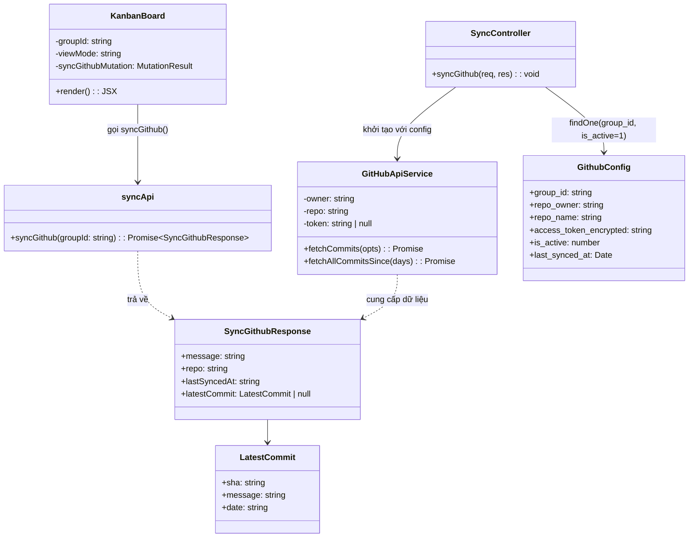
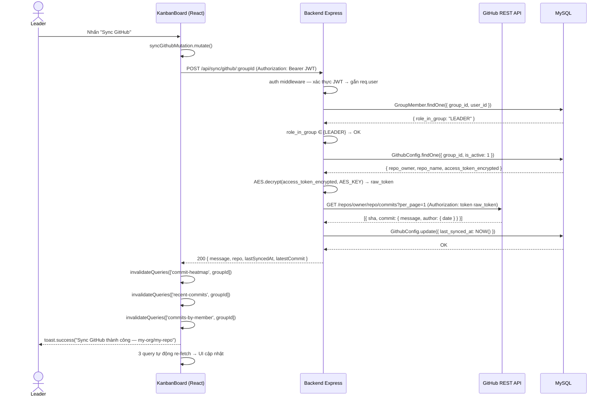
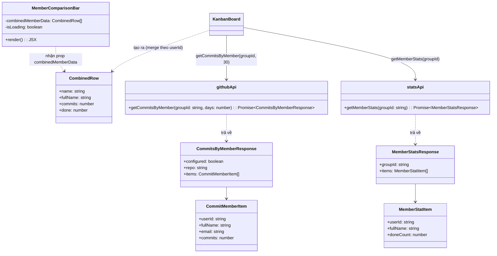

# CHS-27 — Dashboard Team Leader: Commit Heatmap & So Sánh Đóng Góp Thành Viên

> **Mã tính năng:** CHS-27  
> **Module:** Dashboard Team Leader — Tab GitHub (KanbanBoard)  
> **Phiên bản:** 1.0  
> **Ngày:** 27/03/2026  
> **Tác giả:** Nhóm Phát Triển

---

## Định Nghĩa & Thuật Ngữ Viết Tắt

| Thuật ngữ | Giải thích |
|---|---|
| SRS | Software Requirement Specification — Đặc tả yêu cầu phần mềm |
| SDD | Software Design Description — Mô tả thiết kế phần mềm |
| API | Application Programming Interface — Giao diện lập trình ứng dụng |
| UI | User Interface — Giao diện người dùng |
| Leader | Trưởng nhóm dự án (role_in_group = `LEADER`) |
| Heatmap | Biểu đồ lưới đổ màu theo mật độ dữ liệu — đậm = nhiều, nhạt = ít |
| Commit | Một lần lưu thay đổi code lên repository GitHub |
| SHA | Mã định danh duy nhất 40 ký tự hex của mỗi commit; UI hiển thị 7 ký tự đầu |
| Grouped Bar | Biểu đồ cột nhóm — mỗi nhóm cột đại diện một thành viên, mỗi cột trong nhóm là một chỉ số |
| AES-256 | Thuật toán mã hoá đối xứng 256-bit bảo vệ Personal Access Token lưu trong DB |
| PAT | Personal Access Token — token xác thực GitHub API do người dùng cấp quyền `repo:read` |
| relativeTime | Plugin `dayjs` trả về khoảng thời gian dạng "3 phút trước", "2 ngày trước" (locale vi) |
| staleTime | Thời gian cache TanStack Query trước khi coi dữ liệu cũ và cần re-fetch |
| lazy fetch | Kỹ thuật chỉ gọi API khi component thực sự được hiển thị (`enabled` = điều kiện runtime) |
| Recharts | Thư viện biểu đồ React — dùng `BarChart`, `Bar`, `XAxis`, `YAxis`, `ResponsiveContainer` |
| dayjs | Thư viện xử lý ngày tháng nhẹ (~2 kB) cho JavaScript |

---

## Mục Lục

1. [III. Đặc Tả Yêu Cầu Phần Mềm (SRS)](#iii-đặc-tả-yêu-cầu-phần-mềm-srs)
   - 3.1 Tổng quan màn hình
   - 3.2 Tab GitHub & Nút Sync GitHub
   - 3.3 Biểu Đồ Commit Activity Heatmap
   - 3.4 Biểu Đồ So Sánh Thành Viên (Grouped Bar Chart)
   - 3.5 Timeline 10 Commit Gần Nhất
   - 3.6 Yêu cầu phi chức năng
2. [IV. Mô Tả Thiết Kế Phần Mềm (SDD)](#iv-mô-tả-thiết-kế-phần-mềm-sdd)
   - 4.1 Kiến trúc hệ thống
   - 4.2 Thiết kế cơ sở dữ liệu liên quan
   - 4.3 Thiết kế API
   - 4.4 Thiết kế chi tiết (Class Diagram + Sequence Diagram)
3. [VI. Gói Phát Hành & Hướng Dẫn Sử Dụng](#vi-gói-phát-hành--hướng-dẫn-sử-dụng)

---

## III. Đặc Tả Yêu Cầu Phần Mềm (SRS)

### 3.1 Tổng Quan Màn Hình

#### 3.1.1 Sơ Đồ Luồng Màn Hình

```
[KanbanBoard — /board/:groupId]
        │
        ▼
[Segmented Control — góc trên phải]
        │
        ├── Board  (mặc định)
        ├── List
        └── GitHub  ◄── CHS-27
                │
                ▼
        [Tab GitHub Analytics]
                │
                ├──► [Header]
                │         ├── Icon GitHub + Tiêu đề "GitHub Analytics"
                │         ├── Tag tên repo "owner/name" (xanh lá)
                │         └── Nút "Sync GitHub" (type=primary, icon SyncOutlined)
                │                   └── onClick → POST /api/sync/github/:groupId
                │                             └── toast thành công / lỗi
                │
                ├──► [Card: Commit Activity — 90 ngày qua]  ◄── 3.3
                │         └── CommitHeatmap (lưới 7 hàng × N cột)
                │                   └── Hover ô → Tooltip: "X commits ngày YYYY-MM-DD"
                │
                └──► [Row gồm 2 panel cạnh nhau]
                          │
                          ├──► [Col 14/24: Card "So sánh đóng góp thành viên"]  ◄── 3.4
                          │         └── Recharts BarChart (Grouped)
                          │                   ├── Cột tím #722ed1 = Commits (30 ngày)
                          │                   └── Cột xanh lá #52c41a = Task Done (tổng)
                          │
                          └──► [Col 10/24: Card "10 Commit gần nhất"]  ◄── 3.5
                                    └── Ant Design List
                                              └── Avatar + Message + SHA + "X phút trước" + link
```

#### 3.1.2 Mô Tả Màn Hình

| # | Tính năng | Vị trí | Mô tả |
|---|---|---|---|
| 1 | Tab GitHub | Segmented Control | Tab thứ 3 trong thanh điều hướng Board/List/GitHub; lazy fetch — chỉ gọi API khi tab được chọn lần đầu |
| 2 | Nút Sync GitHub | Header tab GitHub | Kích hoạt kết nối lại GitHub API, cập nhật `last_synced_at`, invalidate 3 query cache; chỉ Leader/Admin thực hiện được |
| 3 | Commit Heatmap | Card trên cùng tab GitHub | Lưới 7×N đổ màu theo số commit từng ngày trong 90 ngày qua |
| 4 | Grouped Bar Chart | Panel trái row 2 | So sánh đóng góp commits (tím) và task done (xanh) của từng thành viên trên cùng biểu đồ |
| 5 | Recent Commits Timeline | Panel phải row 2 | Danh sách 10 commit mới nhất: avatar, message, SHA, thời gian tương đối, link GitHub |

#### 3.1.3 Phân Quyền Màn Hình

| Màn hình / Hành động | Admin | Leader | Member | Giảng viên |
|---|:---:|:---:|:---:|:---:|
| Xem Tab GitHub | ✓ | ✓ | ✓ | ✗ |
| Xem Commit Heatmap | ✓ | ✓ | ✓ | ✗ |
| Xem Grouped Bar Chart | ✓ | ✓ | ✓ | ✗ |
| Xem Recent Commits | ✓ | ✓ | ✓ | ✗ |
| Nhấn Sync GitHub | ✓ | ✓ | ✗ | ✗ |

> **Ghi chú:** Backend kiểm tra `role_in_group ∈ {LEADER}` hoặc `user.role = ADMIN` cho `POST /api/sync/github/:groupId`. Member được phép xem nhưng nút Sync không gọi được API (trả về HTTP 403).

---

### 3.2 Tab GitHub & Nút Sync GitHub

- **Role:** Leader, Admin

- **Function trigger:**  
  Leader đăng nhập → điều hướng đến `/board/:groupId` → nhấn tab **"GitHub"** trong Segmented Control → hệ thống tự động fetch dữ liệu lần đầu; nhấn nút **"Sync GitHub"** để kiểm tra lại kết nối và làm mới toàn bộ analytics

- **Mô tả chức năng:**
  - **Mục đích:** Tích hợp thống kê GitHub ngay bên trong màn hình Kanban Board đang có, không cần điều hướng sang trang khác. Leader có thể theo dõi hoạt động code song song với quản lý task mà không gián đoạn workflow.
  - **Giao diện:**
    - Thanh Segmented Control hiển thị 3 tùy chọn: `[Board] [List] [GitHub]`; khi chọn "GitHub" phần board/list bị ẩn, thay bằng GitHub Analytics panel.
    - Header của panel: Icon `<GithubOutlined />` + tiêu đề "GitHub Analytics" + Tag xanh lá `owner/repo` (chỉ hiện khi `configured = true`) + nút "Sync GitHub" (`type="primary"`, có `icon={<SyncOutlined spin={isPending} />}`, loading khi đang gọi API).
    - Khi `configured = false`: hiển thị `<Alert type="info" />` thông báo chưa cấu hình — che toàn bộ analytics panel.
  - **Xử lý dữ liệu:**
    - Nhấn "Sync GitHub" → gọi `syncApi.syncGithub(groupId)` → `POST /api/sync/github/:groupId`
    - Backend: xác thực quyền → lấy `GithubConfig` → giải mã token AES → gọi GitHub API lấy 1 commit xác nhận kết nối → cập nhật `last_synced_at = NOW()` → trả về `{ message, repo, lastSyncedAt, latestCommit }`
    - Frontend: `onSuccess` → `queryClient.invalidateQueries` 3 key: `['commit-heatmap', groupId]`, `['recent-commits', groupId]`, `['commits-by-member', groupId]` → 3 query tự động re-fetch → toast "Sync GitHub thành công — `repo`"

- **Chi tiết chức năng:**
  - **Validation:**
    - Backend kiểm tra `role_in_group` trước khi xử lý; từ chối HTTP 403 nếu không đủ quyền.
    - Backend trả HTTP 404 nếu không tìm thấy `GithubConfig` với `group_id = :groupId AND is_active = 1`.
  - **Business Rules:**
    - Dữ liệu 3 query GitHub chỉ được fetch khi `viewMode === 'github'` (TanStack Query `enabled: !!groupId && viewMode === 'github'`).
    - Tất cả GitHub query có `staleTime: 60_000` (60 giây) và `retry: 1` để hạn chế gọi API GitHub không cần thiết.
    - Sau khi sync thành công, 3 query bị invalidate và tự động re-fetch ngay lập tức.
  - **Normal Case:**
    - GitHub đã cấu hình → header hiển thị tag `owner/name` màu xanh, 3 analytics panel hiển thị đầy đủ.
    - Nhấn Sync → spinner → sau ~1 giây → toast "Sync GitHub thành công — my-org/my-repo".
  - **Abnormal Case:**
    - GitHub chưa cấu hình → `heatmapData.configured === false` → Alert info: "GitHub chưa được cấu hình. Liên hệ Admin để thiết lập tích hợp GitHub (repo_owner, repo_name, access token) cho nhóm này."
    - Token hết hạn (GitHub trả 401) → Backend trả HTTP 401 → toast lỗi: "Sync GitHub thất bại: Token GitHub không hợp lệ hoặc đã hết hạn".
    - Repository bị xoá / private không quyền (GitHub trả 404) → Backend trả HTTP 404 → toast lỗi: "Sync GitHub thất bại: Repository không tìm thấy hoặc không có quyền truy cập".

---

### 3.3 Biểu Đồ Commit Activity Heatmap

- **Role:** Leader, Member, Admin

- **Function trigger:**  
  Người dùng chọn Tab "GitHub" → heatmap tự động fetch 90 ngày gần nhất → render lưới màu ngay khi dữ liệu trả về

- **Mô tả chức năng:**
  - **Mục đích:** Trực quan hoá mật độ commit theo từng ngày trong 90 ngày qua theo phong cách GitHub Contribution Graph. Leader dùng để nhận biết ngay khoảng thời gian nhóm hoạt động tích cực, khoảng nghỉ dài, hoặc peak before deadline.
  - **Giao diện:** Lưới CSS inline-style, bố cục flex, cấu trúc như sau:
    - **Cột trục Y (bên trái):** Nhãn ngày trong tuần, 7 ô, chỉ hiện Mon / Wed / Fri / Sun
    - **Vùng lưới:** Flex row, mỗi phần tử = 1 cột tuần (flex column gồm 7 ô)
    - **Hàng nhãn tháng:** Ở trên cùng vùng lưới; hiện tên tháng (MMM) chỉ ở cột chứa ngày 1–7 của tháng đó
    - **Mỗi ô:** 13×13 px, `borderRadius: 2`, khoảng cách 3px, `cursor: pointer` khi `count > 0`
    - **Tooltip:** Ant Design `<Tooltip>` trên mỗi ô thực sự (ô null/padding không có tooltip), `mouseEnterDelay={0}`, text: `"X commits ngày YYYY-MM-DD"` hoặc `"1 commit ngày ..."`
    - **5 mức màu** (hàm `heatColor(count)`):

      | Mức | Hex | Điều kiện |
      |---|---|---|
      | 0 — Không có | `#ebedf0` | `count === 0` |
      | 1 — Rất ít | `#9be9a8` | `1 ≤ count ≤ 2` |
      | 2 — Ít | `#40c463` | `3 ≤ count ≤ 5` |
      | 3 — Trung bình | `#30a14e` | `6 ≤ count ≤ 10` |
      | 4 — Nhiều | `#216e39` | `count > 10` |

    - **Chú thích màu (Legend):** Hàng ngang căn phải dưới lưới: `Ít ■■■■■ Nhiều`; mỗi ô legend 13×13 px
    - Vùng lưới có `overflowX: auto` để cuộn ngang trên màn hình nhỏ
  - **Xử lý dữ liệu:**
    - Gọi `GET /api/stats/group/:groupId/commits/heatmap?days=90`
    - Backend: auto-paginate GitHub API (tối đa 10 trang × 100 = 1 000 commits), group theo `DATE(commit.commit.author.date)`, build mảng đầy đủ 90 phần tử (kể cả ngày `count = 0`)
    - Frontend nhận `{ configured, repo, heatmap: [{date, count}, ...×90] }`
    - Component `CommitHeatmap` nhận prop `heatmap[]`, tính `firstDow = (firstDate.getDay() + 6) % 7` (Monday = 0), padding null cells phía trước, chia thành mảng tuần

- **Chi tiết chức năng:**
  - **Validation:**
    - `!heatmap?.length` → `<Empty description="Chưa có dữ liệu commit" />`
    - `heatmapLoading === true` → `<Skeleton active paragraph={{ rows: 4 }} />`
  - **Business Rules:**
    - Mảng `heatmap` luôn đủ `days` phần tử (backend fill ngày trống với `count: 0`), không bao giờ có ngày thiếu.
    - Padding null cells bên trái đảm bảo ô ngày đầu tiên luôn nằm đúng hàng thứ tự trong tuần — không bao giờ lệch lưới.
    - Nhãn tháng chỉ xuất hiện ở cột tuần có ngày đầu tiên của tháng (`date.getDate() <= 7`).
    - Cuộn ngang không ảnh hưởng đến padding trục Y — cả 2 được render độc lập trong flex container.
  - **Normal Case:**
    - 90 ô xếp thành lưới 7 hàng × 13 cột (≈90/7), tháng mới xuất hiện trên đầu đúng cột.
    - Hover vào ô ngày 2026-03-15 có `count=7` → tooltip "7 commits ngày 2026-03-15".
    - Hover vào ô có `count=1` → tooltip "1 commit ngày 2026-03-01".
    - Ô `count=0` → màu `#ebedf0`, không có cursor pointer, tooltip hiện "0 commits ngày ...".
  - **Abnormal Case:**
    - GitHub chưa cấu hình → `heatmap` không được render; Alert cấp Tab che lại (xem 3.2).
    - Lỗi mạng / GitHub API timeout → `heatmapLoading = false`, `heatmap` undefined → Empty state; không crash.
    - Đang tải → Skeleton 4 hàng placeholder; không flash trắng.

---

### 3.4 Biểu Đồ So Sánh Thành Viên (Grouped Bar Chart)

- **Role:** Leader, Member, Admin

- **Function trigger:**  
  Tab GitHub được chọn → 2 query `commits-by-member` và `member-stats` fetch song song → khi cả 2 đã có dữ liệu, `combinedMemberData` được tính và biểu đồ render

- **Mô tả chức năng:**
  - **Mục đích:** So sánh hai chiều đóng góp của từng thành viên — số commit GitHub (đo lường hoạt động code) và số task done (đo lường kết quả công việc) — trên cùng một biểu đồ, giúp Leader phát hiện nhanh sự mất cân bằng.
  - **Giao diện:** Recharts `BarChart` grouped (mỗi nhóm 2 cột) với:
    - **Trục X (`XAxis`):** Tên cuối (last name) của từng thành viên, `angle={-20}`, `textAnchor="end"`, `fontSize: 11`, `interval={0}` (hiện tất cả nhãn)
    - **Trục Y (`YAxis`):** Số nguyên không âm, `allowDecimals={false}`, `fontSize: 11`
    - **GridLines:** Ngang (`<CartesianGrid strokeDasharray="3 3" vertical={false} />`)
    - **Cột commits** (`Bar dataKey="commits"`): màu `#722ed1` (tím), `radius={[4,4,0,0]}` (bo trên)
    - **Cột done** (`Bar dataKey="done"`): màu `#52c41a` (xanh lá), `radius={[4,4,0,0]}`
    - **Tooltip** (`RechartTooltip`):
      - `labelFormatter`: hiển thị `fullName` của thành viên thay vì `name` rút gọn
      - `formatter`: cột "commits" → nhãn "Commits"; cột "done" → nhãn "Task Done"
    - **Legend** phía dưới: "Commits" (tím) | "Task Done" (xanh lá)
    - Tiêu đề card: "So sánh đóng góp thành viên" + Tag tím "Commits vs Task Done"
    - Chiều cao: 260px cố định; `<ResponsiveContainer width="100%" height={260} />`
  - **Xử lý dữ liệu:**
    - **Nguồn 1 — commits:** `GET /api/stats/group/:groupId/commits/members?days=30` → `{ items: [{userId, fullName, email, commits}] }`; Backend đếm commits trong 30 ngày qua, map theo `user.email.toLowerCase() === commit.author.email.toLowerCase()`
    - **Nguồn 2 — task done:** `GET /api/stats/group/:groupId/members` → `{ items: [{userId, fullName, doneCount}] }`; Backend COUNT tasks có status ∈ DONE_STATUSES, GROUP BY assignee_id
    - **Merge (frontend):**
      ```
      commitMap = Map<userId → commits>  (từ Nguồn 1)
      combinedMemberData = statsItems.map(m => ({
        name:     m.fullName.split(' ').slice(-1)[0],  // last word = họ hoặc tên cuối
        fullName: m.fullName,
        commits:  commitMap.get(m.userId) ?? 0,
        done:     m.doneCount ?? 0,
      }))
      ```
    - `combinedMemberData` được tính bằng `useMemo([commitsByMemberData, memberStatsData])`; tự động cập nhật khi một trong 2 query thay đổi

- **Chi tiết chức năng:**
  - **Validation:**
    - `combinedMemberData.length === 0` → `<Empty description="Chưa có dữ liệu" />`
    - `commitsByMemberLoading || !memberStatsData` → `<Skeleton active paragraph={{ rows: 5 }} />`
  - **Business Rules:**
    - Commits tính trong 30 ngày qua — window ngắn hơn heatmap (90 ngày) để phản ánh đóng góp sprint hiện tại.
    - Task done là tổng tất cả sprint, không lọc theo sprint — phản ánh toàn bộ năng lực hoàn thành công việc.
    - Thành viên không có email khớp với git author email (do dùng email khác trên GitHub) vẫn xuất hiện với `commits = 0`; không ẩn — Leader biết được ai chưa commit.
    - `name` dùng last word của fullName để label trục X ngắn gọn; `fullName` đầy đủ xuất hiện trong tooltip.
  - **Normal Case:**
    - 5 thành viên → 5 nhóm cột, mỗi nhóm 2 cột.
    - Hover vào cột tím của nhóm "A" → tooltip: "Nguyễn Văn A | Commits: 12".
    - Hover vào cột xanh của nhóm "B" → tooltip: "Trần Thị B | Task Done: 8".
  - **Abnormal Case:**
    - GitHub chưa cấu hình → `commits = 0` cho tất cả, chỉ cột xanh lá có giá trị; biểu đồ vẫn render bình thường.
    - Không có thành viên nào (nhóm rỗng) → `statsItems = []` → `combinedMemberData = []` → Empty state.
    - Đang tải → Skeleton 5 hàng.

---

### 3.5 Timeline 10 Commit Gần Nhất

- **Role:** Leader, Member, Admin

- **Function trigger:**  
  Tab GitHub được chọn → query `recent-commits` fetch 10 commit mới nhất từ nhánh default → render danh sách ngay khi data trả về

- **Mô tả chức năng:**
  - **Mục đích:** Cung cấp cái nhìn nhanh về hoạt động code gần nhất mà không cần mở GitHub. Leader kiểm tra ai commit gần nhất, nội dung commit message có liên quan đến task đang làm không, và nhanh chóng click vào commit để xem diff chi tiết.
  - **Giao diện:** `Ant Design List size="small"`, `dataSource={recentCommitsData.items}`, mỗi entry là `List.Item` với `List.Item.Meta`:

    | Thành phần | Vị trí | Mô tả |
    |---|---|---|
    | Avatar | Trái | Ảnh đại diện GitHub (`avatar_url` nếu có) hoặc chữ cái đầu (`name[0].toUpperCase()`) trên nền màu hash từ `email\|\|name`; kích thước 28px |
    | Message | Title | Dòng đầu tiên của commit message; `ellipsis` nếu dài hơn ~220px; `Tooltip` hiện đầy đủ khi hover; `fontSize: 12` |
    | SHA tag | Description | 7 ký tự đầu commit SHA; `fontFamily: monospace`, `fontSize: 10` |
    | Thời gian | Description | `dayjs(date).fromNow()` với locale vi; ví dụ: "3 phút trước", "2 ngày trước"; `fontSize: 11`, màu secondary |
    | Link view | Description | Hyperlink text "view" mở `html_url` commit trên GitHub trong tab mới; `rel="noopener noreferrer"`, `fontSize: 11` |

  - **Xử lý dữ liệu:**
    - Gọi `GET /api/stats/group/:groupId/commits/recent?limit=10`
    - Backend: `github.fetchCommits({ per_page: 10 })` → gọi GitHub Commits API lấy 1 trang 10 commit mới nhất
    - Map mỗi raw commit → object chuẩn:
      ```json
      {
        "sha":     "a3f9b2c",
        "message": "fix: resolve login redirect loop",
        "author":  {
          "name":      "Nguyễn Văn A",
          "email":     "a@fpt.edu.vn",
          "date":      "2026-03-27T08:42:00Z",
          "avatarUrl": "https://avatars.githubusercontent.com/u/123456",
          "login":     "nguyenvana"
        },
        "url": "https://github.com/my-org/my-project/commit/a3f9b2c..."
      }
      ```
    - `message = commit.commit.message.split('\n')[0]` — chỉ lấy dòng subject (bỏ body sau dòng trống)
    - `avatarUrl = c.author?.avatar_url || null` — lấy từ GitHub user object (khác với `c.commit.author`)

- **Chi tiết chức năng:**
  - **Validation:**
    - `!recentCommitsData?.items?.length` → `<Empty description="Chưa có commit nào" />`
    - `recentCommitsLoading === true` → `<Skeleton active avatar paragraph={{ rows: 3 }} />`
    - Link "view" chỉ render khi `commit.url` khác null/undefined.
  - **Business Rules:**
    - `dayjs` được cấu hình locale `vi` và plugin `relativeTime` ở module level: `dayjs.extend(relativeTime); dayjs.locale('vi')` — áp dụng cho toàn bộ component.
    - Avatar fallback: `avatarUrl === null` → Avatar chữ cái màu hash. Hàm `avatarColor(str)`: `hsl((hash % 360), 55%, 50%)` — cùng hàm dùng cho assignee avatar ở kanban card, đảm bảo màu nhất quán.
    - Link mở `target="_blank"` kèm `rel="noopener noreferrer"` — bảo mật: trang mới không thể truy cập `window.opener` của SPA.
    - Commit message hiển thị tối đa 1 dòng (~220px); người dùng hover để đọc subject dài.
  - **Normal Case:**
    - 10 commit hiển thị theo thứ tự mới nhất ở trên cùng.
    - Commit của GitHub user có avatar URL → ảnh tròn render đúng.
    - Commit của git CLI user không có avatar URL → fallback chữ cái đầu màu nhất quán.
    - Hover vào message bị cắt → tooltip hiện đầy đủ.
    - Nhấn link "view" → tab mới mở đúng trang commit trên GitHub.
  - **Abnormal Case:**
    - Repository rỗng chưa có commit → `items = []` → Empty state.
    - Đang tải → Skeleton với avatar placeholder tròn + 3 hàng text.
    - GitHub chưa cấu hình → panel này không được render (Alert cấp Tab che lại).

---

### 3.6 Yêu Cầu Phi Chức Năng

| # | Loại | Yêu cầu |
|---|---|---|
| NFR-01 | Hiệu suất | Heatmap render trong < 200ms sau khi nhận `heatmap[]` từ API (DOM ≈ 90 ô + Label) |
| NFR-02 | Hiệu suất | Tất cả GitHub query có `staleTime: 60_000` — tránh vượt rate limit 60 req/giờ (unauthenticated) hoặc 5 000 req/giờ (authenticated) của GitHub |
| NFR-03 | Hiệu suất | GitHub query chỉ fetch khi `viewMode === 'github'` (lazy) — không gọi API khi người dùng đang ở tab Board hoặc List |
| NFR-04 | Bảo mật | Personal Access Token mã hoá AES-256 trước khi INSERT vào `github_configs.access_token_encrypted`; không bao giờ trả token trong response API |
| NFR-05 | Bảo mật | Nút Sync GitHub bị từ chối ở backend (`role_in_group ≠ LEADER` → HTTP 403) — không chỉ ẩn ở frontend |
| NFR-06 | Bảo mật | Link "view" trong timeline có `rel="noopener noreferrer"` — ngăn tab mới truy cập `window.opener` |
| NFR-07 | Khả dụng | API lỗi → Empty state với thông báo rõ ràng; không crash trang, không hiện stack trace |
| NFR-08 | Giao diện | Responsive: lưới heatmap cuộn ngang (`overflowX: auto`) trên màn hình nhỏ; Grouped Bar tự co theo `ResponsiveContainer width="100%"` |
| NFR-09 | Khả năng mở rộng | `GitHubApiService` tách thành class riêng tại `src/services/githubApi.service.js` — có thể thêm `fetchPullRequests`, `fetchBranches` mà không sửa controller |
| NFR-10 | Giới hạn | Auto-paginate tối đa 10 trang × 100 = 1 000 commits — bảo vệ server không bị treo do repo rất lớn |

---

## IV. Mô Tả Thiết Kế Phần Mềm (SDD)

### 4.1 Kiến Trúc Hệ Thống

#### 4.1.1 Frontend

| Thư mục / File | Mô tả |
|---|---|
| `src/pages/leader/KanbanBoard.jsx` | Component chính CHS-27; chứa hàm tiện ích `CommitHeatmap`, `heatColor`; 4 GitHub query; mutation `syncGithubMutation`; memo `combinedMemberData`; layout tab GitHub 3-panel |
| `src/api/tasksApi.js` | Export `githubApi` gồm 3 hàm gọi API GitHub stats; export `syncApi.syncGithub` |
| `src/api/axiosClient.js` | Axios instance có JWT Bearer interceptor — dùng chung, không thay đổi |
| `src/auth/AuthContext.jsx` | Context `user.role` — dùng để kiểm tra quyền render nút Sync |

#### 4.1.2 Backend

| Thư mục / File | Mô tả |
|---|---|
| `src/services/githubApi.service.js` | **File mới** — Class `GitHubApiService`: constructor giải mã AES token; `fetchCommits(opts)`; `fetchAllCommitsSince(days)` với auto-paginate (tối đa 10 trang) |
| `src/controllers/tasks.controller.js` | **Bổ sung** `require GithubConfig`, `require GitHubApiService`; thêm 3 handler: `getCommitHeatmap`, `getRecentCommits`, `getCommitsByMember` |
| `src/controllers/sync.controller.js` | **Bổ sung** `require GithubConfig`, `require GitHubApiService`, `require GroupMember`; thêm handler `syncGithub` |
| `src/routes/tasks.routes.js` | **Bổ sung** 3 route GET dưới tiền tố `/stats/group/:groupId/commits/` |
| `src/routes/sync.routes.js` | **Bổ sung** route `POST /github/:groupId` |
| `src/models/githubConfig.model.js` | Dùng trực tiếp, không thay đổi |

#### 4.1.3 Công Nghệ Sử Dụng

| Công nghệ | Phiên bản | Mục đích |
|---|---|---|
| React | 19.2.4 | Framework frontend |
| Ant Design | 6.3.3 | Card, List, Alert, Skeleton, Tag, Tooltip, Segmented, Space, Row/Col |
| Recharts | 3.8.1 | `BarChart`, `Bar`, `XAxis`, `YAxis`, `CartesianGrid`, `Legend`, `ResponsiveContainer` |
| dayjs | 1.11.20 | Plugin `relativeTime` + locale `vi` — thời gian tương đối Tiếng Việt |
| @tanstack/react-query | 5.x | Lazy fetch (`enabled`), `staleTime`, `invalidateQueries` sau sync |
| axios | 1.13.6 | HTTP client gọi GitHub REST API v3 từ backend (`timeout: 15000`) |
| crypto-js | 4.2.0 | `AES.decrypt(token, AES_KEY)` trong `GitHubApiService` constructor |
| Node.js / Express | — | Backend REST API |
| Sequelize + MySQL | — | Truy vấn `github_configs`, `group_members`, `users`, `tasks` |

---

### 4.2 Thiết Kế Cơ Sở Dữ Liệu Liên Quan

#### 4.2.1 Bảng `github_configs`

| Tên cột | Kiểu | Mô tả | Ghi chú |
|---|---|---|---|
| id | CHAR(36) | UUID định danh | PK |
| group_id | CHAR(36) | Nhóm sở hữu config | FK → `groups.id`, UNIQUE |
| repo_owner | VARCHAR(255) | Tổ chức / cá nhân GitHub (e.g. `my-org`) | — |
| repo_name | VARCHAR(255) | Tên repository (e.g. `my-project`) | — |
| access_token_encrypted | TEXT | PAT đã mã hoá AES-256 | Giải mã trong `GitHubApiService` |
| is_active | TINYINT | 1 = đang dùng / 0 = tắt | Backend lọc `is_active = 1` |
| last_synced_at | DATETIME | Thời điểm sync thành công gần nhất | Cập nhật bởi `syncGithub` |
| created_at | DATETIME | Ngày tạo | — |
| updated_at | DATETIME | Ngày cập nhật | — |

#### 4.2.2 Bảng `group_members` (dùng để xác thực quyền & lấy danh sách email)

| Tên cột | Kiểu | Mô tả | Ghi chú |
|---|---|---|---|
| user_id | CHAR(36) | ID thành viên | FK → `users.id` |
| group_id | CHAR(36) | ID nhóm | FK → `groups.id` |
| role_in_group | ENUM | `LEADER` / `MEMBER` / `VIEWER` | Kiểm tra trong `syncGithub` |

#### 4.2.3 Bảng `users` (khớp git author email với tài khoản hệ thống)

| Tên cột | Kiểu | Mô tả | Ghi chú |
|---|---|---|---|
| id | CHAR(36) | UUID | PK |
| email | VARCHAR(255) | Email dùng để khớp với `commit.commit.author.email` | UNIQUE, lowercase match |
| full_name | VARCHAR(255) | Tên hiển thị trên biểu đồ | — |

#### 4.2.4 Bảng `tasks` (lấy `doneCount` cho Grouped Bar)

| Tên cột | Kiểu | Mô tả | Ghi chú |
|---|---|---|---|
| assignee_id | CHAR(36) | FK người được giao | JOIN với `group_members.user_id` |
| status | VARCHAR(100) | Trạng thái task | `LOWER(status) IN ('done','closed','resolved','complete','completed')` |
| group_id | CHAR(36) | Nhóm sở hữu | Lọc theo nhóm hiện tại |

---

### 4.3 Thiết Kế API

| Phương thức | Endpoint | Mô tả | Auth | Query Params |
|---|---|---|---|---|
| GET | `/api/stats/group/:groupId/commits/heatmap` | Số commit từng ngày trong N ngày qua | Bearer JWT | `days` (default 90, max 365) |
| GET | `/api/stats/group/:groupId/commits/recent` | N commit mới nhất | Bearer JWT | `limit` (default 10, max 30) |
| GET | `/api/stats/group/:groupId/commits/members` | Số commit theo thành viên trong N ngày | Bearer JWT | `days` (default 30, max 365) |
| POST | `/api/sync/github/:groupId` | Kiểm tra kết nối, cập nhật `last_synced_at` | Bearer JWT (LEADER / ADMIN) | — |

#### Response — GET `/api/stats/group/:groupId/commits/heatmap?days=90`

```json
{
  "configured": true,
  "repo": "my-org/my-project",
  "heatmap": [
    { "date": "2026-01-07", "count": 0 },
    { "date": "2026-01-08", "count": 3 },
    { "date": "2026-01-09", "count": 7 }
  ]
}
```

> Trường hợp chưa cấu hình: `{ "configured": false, "heatmap": [] }`

#### Response — GET `/api/stats/group/:groupId/commits/recent?limit=10`

```json
{
  "configured": true,
  "repo": "my-org/my-project",
  "items": [
    {
      "sha": "a3f9b2c",
      "message": "fix: resolve login redirect loop",
      "author": {
        "name": "Nguyễn Văn A",
        "email": "a@fpt.edu.vn",
        "date": "2026-03-27T08:42:00Z",
        "avatarUrl": "https://avatars.githubusercontent.com/u/123456",
        "login": "nguyenvana"
      },
      "url": "https://github.com/my-org/my-project/commit/a3f9b2c..."
    }
  ]
}
```

#### Response — GET `/api/stats/group/:groupId/commits/members?days=30`

```json
{
  "configured": true,
  "repo": "my-org/my-project",
  "items": [
    { "userId": "user-001", "fullName": "Nguyễn Văn A", "email": "a@fpt.edu.vn", "commits": 12 },
    { "userId": "user-002", "fullName": "Trần Thị B",   "email": "b@fpt.edu.vn", "commits": 5  },
    { "userId": "user-003", "fullName": "Lê Văn C",     "email": "c@fpt.edu.vn", "commits": 0  }
  ]
}
```

#### Response — POST `/api/sync/github/:groupId`

```json
{
  "message": "Kết nối GitHub thành công",
  "repo": "my-org/my-project",
  "lastSyncedAt": "2026-03-27T09:00:00.000Z",
  "latestCommit": {
    "sha": "a3f9b2c",
    "message": "fix: resolve login redirect loop",
    "date": "2026-03-27T08:42:00Z"
  }
}
```

#### Mã Lỗi API

| HTTP Status | Endpoint | Trường hợp |
|---|---|---|
| 401 | Tất cả | JWT không hợp lệ / hết hạn; hoặc PAT GitHub hết hạn (sync) |
| 403 | POST `/sync/github` | `role_in_group ≠ LEADER` và `user.role ≠ ADMIN` |
| 404 | Tất cả | `github_configs` không tồn tại hoặc `is_active = 0`; hoặc repository GitHub không tìm thấy |
| 500 | Tất cả | Lỗi nội bộ server, timeout GitHub API |

---

### 4.4 Thiết Kế Chi Tiết

#### 4.4.1 Nút Sync GitHub

##### 4.4.1.1 Class Diagram



##### 4.4.1.2 Sequence Diagram



---

#### 4.4.2 Commit Activity Heatmap

##### 4.4.2.1 Class Diagram

```mermaid
classDiagram
    class CommitHeatmap {
        -heatmap: HeatCell[]
        +heatColor(count: number): string
        +render(): JSX
    }

    class HeatCell {
        +date: string
        +count: number
    }

    class githubApi {
        +getCommitHeatmap(groupId: string, days: number): Promise~HeatmapResponse~
    }

    class HeatmapResponse {
        +configured: boolean
        +repo: string
        +heatmap: HeatCell[]
    }

    class HeatmapController {
        +getCommitHeatmap(req, res): void
    }

    class GitHubApiService {
        +fetchAllCommitsSince(days: number): Promise~RawCommit[]~
    }

    CommitHeatmap ..> HeatCell : nhận prop heatmap[]
    KanbanBoard --> githubApi : getCommitHeatmap(groupId, 90)
    githubApi ..> HeatmapResponse : trả về
    HeatmapResponse --> HeatCell
    HeatmapController --> GitHubApiService : fetchAllCommitsSince(days)
    KanbanBoard --> CommitHeatmap : props: heatmap
```

##### 4.4.2.2 Sequence Diagram

```mermaid
sequenceDiagram
    actor User as Leader/Member
    participant Board as KanbanBoard (React)
    participant Heatmap as CommitHeatmap (Component)
    participant API as Backend Express
    participant GH as GitHub REST API

    User->>Board: Nhấn Tab "GitHub"
    Board->>Board: setViewMode("github") → enabled = !!groupId && viewMode==="github" → true

    Board->>API: GET /api/stats/group/:groupId/commits/heatmap?days=90 (Bearer JWT)
    API->>API: ensureGroupAccess(user, groupId)
    API->>API: GithubConfig.findOne()

    alt GitHub chưa cấu hình
        API-->>Board: { configured: false, heatmap: [] }
        Board-->>User: Render Alert "GitHub chưa được cấu hình"
    else GitHub đã cấu hình
        loop Auto-paginate (tối đa 10 trang)
            API->>GH: GET /repos/owner/repo/commits?since=T-90d&per_page=100&page=N
            GH-->>API: [commits × 100] hoặc ít hơn
            API->>API: all.concat(batch); nếu batch.length < 100 thì break
        end

        API->>API: Group commits by DATE(author.date) → countByDate Map
        API->>API: Build full range [today-89 … today]; fill 0 cho ngày không có commit
        API-->>Board: { configured: true, repo, heatmap: [{date, count} × 90] }

        Board->>Heatmap: props: heatmap=[{date,count} × 90]
        Heatmap->>Heatmap: firstDow = (firstDate.getDay() + 6) % 7
        Heatmap->>Heatmap: padded = [null×firstDow, ...heatmap]
        Heatmap->>Heatmap: weeks = chunk(padded, 7)
        Heatmap-->>User: Render lưới 7 hàng × N cột với màu heatColor(count)
    end

    User->>Heatmap: Hover vào ô {date:"2026-03-15", count:7}
    Heatmap-->>User: Tooltip: "7 commits ngày 2026-03-15"
```

---

#### 4.4.3 Grouped Bar Chart — So Sánh Đóng Góp Thành Viên

##### 4.4.3.1 Class Diagram



##### 4.4.3.2 Sequence Diagram

```mermaid
sequenceDiagram
    actor User as Leader/Member
    participant Board as KanbanBoard (React)
    participant Bar as MemberComparisonBar (Recharts)
    participant API as Backend Express
    participant GH as GitHub REST API
    participant DB as MySQL

    User->>Board: Nhấn Tab "GitHub"

    par Fetch commits/member (30 ngày)
        Board->>API: GET /api/stats/group/:groupId/commits/members?days=30
        API->>GH: fetchAllCommitsSince(30) — auto-paginate
        GH-->>API: [commits × N]
        API->>API: countByEmail = {} ; group by author.email.toLowerCase()
        API->>DB: SELECT u.id, u.email, u.full_name FROM users WHERE id IN (memberIds)
        DB-->>API: [{ id, email, full_name }]
        API->>API: Map email → commits cho từng user
        API-->>Board: { items: [{ userId, fullName, email, commits }] }
    and Fetch member task stats
        Board->>API: GET /api/stats/group/:groupId/members
        API->>DB: SELECT assignee_id, COUNT(*) AS assignedCount,\n SUM(CASE WHEN LOWER(status) IN done THEN 1 END) AS doneCount\nFROM tasks WHERE group_id=? GROUP BY assignee_id
        DB-->>API: [{ assignee_id, assignedCount, doneCount }]
        API-->>Board: { items: [{ userId, fullName, doneCount, ... }] }
    end

    Board->>Board: commitMap = new Map(items.map(i => [i.userId, i.commits]))
    Board->>Board: combinedMemberData = statsItems.map(m => ({<br/>  name: m.fullName.split(' ').at(-1),<br/>  fullName: m.fullName,<br/>  commits: commitMap.get(m.userId) ?? 0,<br/>  done: m.doneCount ?? 0<br/>}))

    Board->>Bar: props: combinedMemberData, isLoading=false
    Bar-->>User: Render BarChart: cột tím=commits, cột xanh=done theo từng thành viên

    User->>Bar: Hover cột tím nhóm "A"
    Bar-->>User: Tooltip: "Nguyễn Văn A | Commits: 12"
    User->>Bar: Hover cột xanh nhóm "B"
    Bar-->>User: Tooltip: "Trần Thị B | Task Done: 8"
```

---

#### 4.4.4 Timeline 10 Commit Gần Nhất

##### 4.4.4.1 Class Diagram

```mermaid
classDiagram
    class RecentCommitTimeline {
        -items: CommitItem[]
        -isLoading: boolean
        +render(): JSX
    }

    class CommitItem {
        +sha: string
        +message: string
        +author: CommitAuthor
        +url: string | null
    }

    class CommitAuthor {
        +name: string
        +email: string
        +date: string
        +avatarUrl: string | null
        +login: string | null
    }

    class githubApi {
        +getRecentCommits(groupId: string, limit: number): Promise~RecentCommitsResponse~
    }

    class RecentCommitsResponse {
        +configured: boolean
        +repo: string
        +items: CommitItem[]
    }

    class RecentCommitsController {
        +getRecentCommits(req, res): void
    }

    class GitHubApiService {
        +fetchCommits(opts): Promise~RawCommit[]~
    }

    KanbanBoard --> githubApi : getRecentCommits(groupId, 10)
    githubApi ..> RecentCommitsResponse : trả về
    RecentCommitsResponse --> CommitItem
    CommitItem --> CommitAuthor
    RecentCommitTimeline ..> CommitItem : nhận prop items[]
    RecentCommitsController --> GitHubApiService : fetchCommits({ per_page: 10 })
```

##### 4.4.4.2 Sequence Diagram

```mermaid
sequenceDiagram
    actor User as Leader/Member
    participant Board as KanbanBoard (React)
    participant Timeline as Ant Design List
    participant API as Backend Express
    participant GH as GitHub REST API

    User->>Board: Nhấn Tab "GitHub"
    Board->>API: GET /api/stats/group/:groupId/commits/recent?limit=10 (Bearer JWT)
    API->>API: ensureGroupAccess() ; GithubConfig.findOne()
    API->>GH: GET /repos/owner/repo/commits?per_page=10&page=1
    GH-->>API: [commit1...commit10] (mới nhất trên đầu)

    API->>API: Map raw → CommitItem[]
    note right of API: sha = c.sha.slice(0,7)\nmessage = c.commit.message.split('\n')[0]\nauthor.avatarUrl = c.author?.avatar_url\nauthor.date = c.commit.author.date\nurl = c.html_url

    API-->>Board: { configured: true, repo, items: [CommitItem×10] }
    Board->>Timeline: dataSource={items}
    Timeline-->>User: Render List 10 item (mới nhất trên cùng)
    note over Timeline,User: Mỗi item: Avatar (ảnh|chữ đầu) + Message (ellipsis+Tooltip)\n+ SHA tag + dayjs.fromNow() + link "view"

    User->>Timeline: Hover vào message bị cắt ngắn
    Timeline-->>User: Tooltip: nội dung commit message đầy đủ

    User->>Timeline: Nhấn link "view" của commit đầu tiên
    Timeline-->>User: Mở tab mới: https://github.com/owner/repo/commit/a3f9b2c (rel=noopener)
```

---

## VI. Gói Phát Hành & Hướng Dẫn Sử Dụng

### 1. Gói Phát Hành (Deliverable Package)

| # | Hạng mục | File | Nội dung thay đổi |
|---|---|---|---|
| 1 | Source Code FE | `frontend/src/pages/leader/KanbanBoard.jsx` | Thêm import `recharts`, `dayjs/relativeTime`, `dayjs/locale/vi`, `GithubOutlined`, `BranchesOutlined`; thêm hằng số `HEAT_COLORS`, hàm `heatColor`, component `CommitHeatmap`; thêm 4 query GitHub (heatmap, recentCommits, commitsByMember, memberStats); thêm `syncGithubMutation`; thêm memo `combinedMemberData`; thêm tab "GitHub" trong Segmented + toàn bộ layout 3 panel |
| 2 | Source Code FE | `frontend/src/api/tasksApi.js` | Thêm export mới `githubApi` 3 hàm; thêm `syncApi.syncGithub` |
| 3 | Source Code BE | `backend/src/services/githubApi.service.js` | **File mới** — Class `GitHubApiService` với constructor, `_headers()`, `fetchCommits(opts)`, `fetchAllCommitsSince(days)` |
| 4 | Source Code BE | `backend/src/controllers/tasks.controller.js` | Thêm `require GithubConfig`, `require GitHubApiService`; thêm cuối file: `exports.getCommitHeatmap`, `exports.getRecentCommits`, `exports.getCommitsByMember` |
| 5 | Source Code BE | `backend/src/controllers/sync.controller.js` | Thêm `require GithubConfig`, `require GroupMember`, `require GitHubApiService`; thêm cuối file: `exports.syncGithub` |
| 6 | Source Code BE | `backend/src/routes/tasks.routes.js` | Thêm 3 dòng route: `GET /stats/group/:groupId/commits/heatmap`, `/recent`, `/members` |
| 7 | Source Code BE | `backend/src/routes/sync.routes.js` | Thêm 1 dòng route: `POST /github/:groupId` |
| 8 | Dependency | — | Không cần cài thêm; `recharts ^3.8.1`, `dayjs ^1.11.20`, `axios ^1.13.6`, `crypto-js ^4.2.0` đã có sẵn trong `package.json` |
| 9 | Tài liệu | `docs/CHS-27_Dashboard_Leader_CommitHeatmap_MemberComparison.md` | File tài liệu này |

---

### 2. Hướng Dẫn Cài Đặt

#### 2.1 Yêu Cầu Hệ Thống

| Thành phần | Tối thiểu | Khuyến nghị |
|---|---|---|
| Trình duyệt | Chrome 110+ / Firefox 110+ | Chrome phiên bản mới nhất |
| Độ phân giải | 1024 × 768 | 1280 × 800 trở lên |
| Kết nối mạng | 10 Mbps | 50 Mbps (backend gọi GitHub API ra ngoài) |
| Backend | Node.js ≥ 18 | Node.js 20 LTS |

#### 2.2 Điều Kiện Tiên Quyết — Cấu Hình GitHub

Tính năng CHS-27 yêu cầu Admin cấu hình tích hợp GitHub cho từng nhóm **trước khi** Leader sử dụng:

```
Bước 1: Đăng nhập tài khoản Admin
Bước 2: Vào Admin Panel → Quản lý nhóm → Chọn nhóm cần cấu hình
Bước 3: Chọn tab "GitHub Config"
Bước 4: Điền thông tin repository:
         - repo_owner: tên tổ chức hoặc cá nhân GitHub (ví dụ: my-org)
         - repo_name: tên repository (ví dụ: my-project)
Bước 5: Tạo Personal Access Token (PAT) trên GitHub:
         a. Truy cập: https://github.com/settings/tokens
         b. Nhấn "Generate new token (classic)"
         c. Đặt tên mô tả: ví dụ "CNPM-App-ReadRepo"
         d. Tick scope: ☑ repo (full control of private repositories)
         e. Nhấn "Generate token" → copy token (chỉ hiện 1 lần)
Bước 6: Paste token vào trường "Access Token" trong Admin Panel → Lưu
Bước 7: Nhấn "Test kết nối" → thông báo "GitHub connection successful" → OK
```

#### 2.3 Khởi Động Lại Server

Sau khi thêm code mới, chạy lệnh sau để restart backend:

```bash
cd backend
npm run dev
```

Frontend không cần khởi động lại (Vite HMR tự động cập nhật).

---

### 3. Hướng Dẫn Sử Dụng

#### 3.1 Tổng Quan

Leader sử dụng Tab GitHub trong Kanban Board để:
- Theo dõi lịch sử hoạt động code 90 ngày qua thông qua heatmap trực quan
- So sánh mức độ đóng góp của từng thành viên (commits + task done) trên cùng biểu đồ
- Kiểm tra nhanh 10 commit mới nhất mà không phải mở trình duyệt GitHub
- Kích hoạt làm mới dữ liệu thủ công khi cần

#### 3.2 Truy Cập Tab GitHub

- **Bước 1:** Đăng nhập bằng tài khoản Leader
- **Bước 2:** Từ Dashboard Leader → nhấn **"Mở Board"** trên card nhóm muốn xem
- **Bước 3:** Trang Kanban Board hiện ra → nhìn góc trên phải thấy thanh điều hướng: `[Board] [List] [GitHub]`
- **Bước 4:** Nhấn **"GitHub"** → dữ liệu tải lần đầu (Skeleton loading xuất hiện trong ~1–2 giây)
- **Lưu ý:** Nếu thấy Alert màu xanh "GitHub chưa được cấu hình" → liên hệ Admin thực hiện bước cài đặt trong mục 2.2

#### 3.3 Đọc Commit Activity Heatmap (90 ngày)

- **Bước 1:** Nhìn vào card **"Commit Activity — 90 ngày qua"** phía trên cùng của Tab GitHub
- **Bước 2:** Định hướng lưới:
  - Cột **bên phải nhất** = tuần hiện tại (hôm nay)
  - Cột **bên trái nhất** = tuần ~90 ngày trước
  - Hàng **trên cùng** = Thứ Hai (Mon); hàng **dưới cùng** = Chủ Nhật (Sun)
  - Tên tháng hiển thị phía trên cột đầu tiên của mỗi tháng
- **Bước 3:** Đọc màu sắc:
  - Ô xám nhạt `#ebedf0` = không có commit ngày đó
  - Ô xanh nhạt `#9be9a8` = 1–2 commits
  - Ô xanh vừa `#40c463` = 3–5 commits
  - Ô xanh đậm `#30a14e` = 6–10 commits
  - Ô xanh rất đậm `#216e39` = hơn 10 commits
- **Bước 4:** Di chuột vào ô bất kỳ → tooltip hiện số commit và ngày cụ thể
- **Bước 5:** Đánh giá:
  - Dải xanh đậm liên tiếp → nhóm đang làm việc tập trung ✓
  - Mảng xám kéo dài nhiều tuần → khoảng nghỉ dài, Leader nên kiểm tra nguyên nhân
  - Xanh đậm đột biến trước deadline → nhóm dồn công việc cuối sprint ⚠

#### 3.4 Đọc Biểu Đồ So Sánh Thành Viên

- **Bước 1:** Kéo xuống hoặc nhìn vào panel trái **"So sánh đóng góp thành viên"** (tag tím "Commits vs Task Done")
- **Bước 2:** Mỗi nhóm cột = 1 thành viên; trong mỗi nhóm có 2 cột:
  - **Cột tím**: số commit GitHub trong 30 ngày qua
  - **Cột xanh lá**: số task đã done (tổng tất cả sprint)
- **Bước 3:** Di chuột vào bất kỳ cột nào → tooltip hiển thị đầy đủ tên thành viên và giá trị
- **Bước 4:** Đánh giá từng thành viên:

  | Pattern | Ý nghĩa | Hành động đề xuất |
  |---|---|---|
  | Tím cao + Xanh cao | Đóng góp đều cả code lẫn task | Thành viên đang làm tốt ✓ |
  | Tím cao + Xanh thấp | Commit nhiều nhưng task chưa xong | Kiểm tra chất lượng code, tránh over-engineering |
  | Tím thấp + Xanh cao | Task done nhiều nhưng ít commit | Có thể review code, quản lý, hoặc chưa push code |
  | Tím = 0 + Xanh = 0 | Chưa đóng góp | Leader cần hỗ trợ / xác nhận lại trực tiếp |

#### 3.5 Xem Timeline 10 Commit Gần Nhất

- **Bước 1:** Nhìn vào panel phải **"10 Commit gần nhất"**
- **Bước 2:** Mỗi dòng trong danh sách gồm:
  - **Avatar** bên trái: ảnh GitHub của người commit (hoặc chữ cái đầu màu nhận diện)
  - **Message** (in đậm): nội dung commit — di chuột để đọc đầy đủ nếu bị cắt
  - **SHA** (font monospace): mã định danh 7 ký tự của commit
  - **Thời gian**: khoảng thời gian tương đối ("3 phút trước", "2 ngày trước")
  - **Link "view"**: nhấn để mở chi tiết commit trên GitHub (tab mới)
- **Bước 3:** Dùng thông tin này để:
  - Xác nhận thành viên đang active sau một kỳ nghỉ
  - Kiểm tra commit message có mô tả công việc rõ ràng không
  - Cross-check với jira key trong commit message (ví dụ: `"feat: PROJ-42 add login page"`)

#### 3.6 Sync GitHub Thủ Công

- **Bước 1:** Nhìn vào header của Tab GitHub (góc trên phải section Analytics)
- **Bước 2:** Nhấn nút **"Sync GitHub"** màu xanh dương
- **Bước 3:** Nút chuyển sang loading (spinner quay, text "Sync GitHub")
- **Bước 4:** Kết quả sau ~1–3 giây:

  | Kết quả | Toast | Hành động tiếp theo |
  |---|---|---|
  | Thành công | ✅ "Sync GitHub thành công — owner/repo" | Toàn bộ biểu đồ tự động làm mới |
  | Token hết hạn | ❌ "Token GitHub không hợp lệ hoặc đã hết hạn" | Liên hệ Admin cập nhật PAT mới |
  | Repo bị xoá / private | ❌ "Repository không tìm thấy hoặc không có quyền truy cập" | Liên hệ Admin kiểm tra repo_owner/repo_name |
  | Chưa cấu hình | Alert info (hiện ngay lúc vào tab) | Liên hệ Admin thiết lập GitHub Config |

- **Lưu ý:** Dữ liệu được cache 60 giây. Sau khi sync xong, biểu đồ cập nhật ngay lập tức; nhấn Sync lại trong vòng 60 giây tiếp theo sẽ gọi API thật nhưng dữ liệu hiển thị không thay đổi cho đến khi cache hết hạn.

---

*Tài liệu này được viết dựa trên codebase thực tế tại `d:\CNPM\CNPM_HK2_SN` và tuân thủ định dạng tài liệu chuẩn Capstone Project (4551_SP25SE107_GSP46).*
